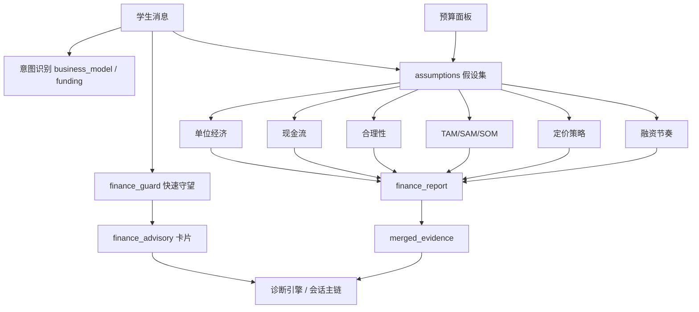

# 商业模式生成、差异化盈利方案与财务智能体会话干预说明

本文对应最终说明书中的这一部分：

> 关注商业模式，针对不同项目生成不同的盈利方案（包含 TAM / SAM / SOM 等）；并说明财务预算部分的智能体如何在会话过程中介入和干预财务问题。

这篇文档的重点不是单纯介绍“有一个预算页面”，而是说明：

1. 系统如何在会话中识别出这是一个**商业模式 / 财务 / 融资**问题。
2. 为什么系统不会给所有项目套同一种盈利方案，而是会按**行业 / 阶段 / 是否公益项目**走不同建模路径。
3. 财务智能体如何把预算面板与会话内容结合起来，输出 **TAM / SAM / SOM、CAC / LTV / BEP、定价、融资节奏** 等结构化结果。
4. 这些结果如何反过来影响主聊天链路、风险诊断和后续计划书生成。

---

## 一、模块定位：我们不是只“回答商业模式问题”，而是在做商业模式量化建模

很多系统在学生问“怎么盈利”“TAM 怎么算”“我该怎么定价”时，只会直接给一段泛化建议。  
而本系统的设计不是停留在“概念解释”，而是把商业模式问题拆成可计算、可诊断、可回流的结构化对象。

因此它不是一个单独的 Prompt，而是一条由五层组成的链路：

1. **意图识别层**  
   判断学生是不是在讨论商业模式、市场规模、定价、融资、单位经济。

2. **会话旁路财务守望层**  
   在对话进行中快速检测是否需要即时插入财务提醒卡。

3. **预算与财务建模层**  
   从预算面板中提取关键参数，构造可计算的假设集。

4. **深度财务报告层**  
   跑六个模块，输出完整财务分析报告。

5. **诊断回流层**  
   把财务建模证据回流到风险诊断和主聊天链路中。

---

## 二、会话里是怎么识别“这是商业模式问题”的

在主编排链路 `graph_workflow.py` 中，系统把下面这些词都视为商业模式意图的重要信号：

- 商业模式
- 盈利
- 收入
- 成本
- 市场规模
- `TAM` / `SAM` / `SOM`
- `CAC` / `LTV`
- 定价
- 渠道
- 变现
- 收费

也就是说，学生只要开始讨论：

- 怎么挣钱
- 市场到底有多大
- 定价是否合理
- CAC / LTV 怎么算
- 融资轮次匹不匹配

系统就不会把它当成普通聊天，而会优先走商业模式与财务相关链路。

这非常重要，因为本系统并不是等学生点进预算页才开始做财务分析，而是：

> 在对话阶段就已经把“商业模式”视为一个专门的结构化问题域。

---

## 三、为什么我们能“针对不同项目生成不同盈利方案”

这是这一篇最关键的部分。

系统之所以不是给所有项目套统一盈利模板，是因为财务建模核心会先做**项目类型归一化**。

### 3.1 行业匹配不是写死的，而是先做识别

`finance_analyst.py` 里 `_match_industry()` 会先把项目归到几个主要类别，例如：

- 教育
- SaaS
- 电商
- 硬件
- 社会公益

匹配依据来自：

- 会话内容
- 项目描述
- 预算输入
- 行业提示词

因此，一个“面向学校的订阅工具”和一个“硬件设备创业项目”，后续不会走同一套定价或单位经济逻辑。

### 3.2 公益项目与商业项目会走不同口径

这点非常适合写进你的说明书里，因为它体现了“不同项目不同盈利方案”的真正含义。

对于商业项目，系统核心看：

- 单价 `monthly_price`
- 毛利率 `gross_margin`
- 月留存 `monthly_retention`
- 获客成本 `CAC`
- `LTV/CAC`
- 回本周期 `Payback`

但对于 **社会公益 / 非营利** 项目，系统不会硬套商业逻辑，而是切换为：

- 单位受益人成本 `CPB`
- 可持续性收入占比
- 服务效率与公益可持续性

这意味着系统不是把公益项目也强行写成“怎么赚钱”，而是承认：

> 公益项目的核心不在盈利最大化，而在单位受益成本与持续运行能力。

因此，“不同项目生成不同盈利方案”在系统里不是一句口号，而是真正落实为：

- 商业项目：利润与单位经济口径
- 公益项目：受益人与可持续性口径

---

## 四、系统如何在会话中“即时干预”财务问题

这部分由 `finance_guard` 完成，它是一个对话旁路财务守望钩子。

### 4.1 它为什么重要

`finance_guard` 的定位不是深度报告，而是：

> 学生每发一条消息，后台都快速扫一遍，如果这条消息已经暴露出定价、市场规模、融资或单位经济问题，就立刻给出财务提醒卡。

因此它的角色更像“聊天中的财务安全网”。

### 4.2 它检测什么

`finance_guard` 会看几类触发信号：

- `pricing`：定价、收费、月费、年费、会员、订阅
- `unit_econ`：CAC、LTV、留存、毛利、付费率
- `market`：市场规模、TAM、SAM、SOM
- `cashflow`：烧钱、现金流、回本、盈亏平衡、Runway
- `funding`：融资、天使轮、A 轮、投资人、估值
- `cost`：固定成本、变动成本、服务器成本、运营成本
- `nonprofit`：公益、慈善、受益人、捐赠等

也就是说，学生只要在对话里提到这些内容，财务模块就可能立即介入。

### 4.3 它怎么做到“低延迟干预”

`finance_guard` 不调用 LLM，而是只做：

- 关键词命中
- 正则抽数
- 轻量 slot fill
- 纯计算模块

这样设计的目的很明确：

- 不阻塞主对话
- 失败也不影响聊天主链
- 把财务干预控制在即时、轻量、低风险的范围内

### 4.4 它在对话中具体输出什么

如果扫描后发现确实存在风险，`finance_guard` 会返回：

- `triggered`
- `hits`
- `cards`
- `evidence_for_diagnosis`
- `industry`

其中 `cards` 就是前端展示的财务提醒卡，例如：

- 单位经济卡
- 合理性卡
- 定价框架卡

而且只有当结论是：

- `red`
- `yellow`

时才会真正打扰用户。全绿时不干扰。

这说明系统不是“逢财务必提醒”，而是只有在真正检测到问题时才插入。

### 4.5 它是怎么挂回聊天结果的

在 `main.py` 中，本轮聊天跑完主工作流后，会额外调用一次 `finance_guard_scan(...)`。  
如果命中了财务风险，就把结果挂到本轮 `agent_trace["finance_advisory"]` 上。

这意味着财务模块不是外部页面独立运行，而是：

> 直接进入本轮聊天结果，成为学生当前会话的一部分。

---

## 五、会话里干预的不是“抽象建议”，而是结构化财务假设

为了做到会话侧即时干预，系统不会等学生完整填写预算表，而是先在文本中抽取轻量假设。

`slot_fill_from_text()` 会尽量从对话中抓出：

- 月价 / 单价 `monthly_price`
- 付费转化率 `paid_conversion_rate`
- 月留存 `monthly_retention`
- 毛利率 `gross_margin`
- 获客成本 `cac`
- 用户规模 `target_user_population`
- 年 ARPU `annual_arpu`
- 单位受益人成本 `cost_per_beneficiary`

这说明学生即使还没有进入预算面板，只要在聊天中说出：

- “我们打算月费 39 元”
- “预估 5% 转化”
- “获客成本大概 300”
- “目标用户大概 10 万”

系统就已经能开始做第一轮财务判断了。

换句话说，财务智能体在会话中干预的基础不是猜测，而是：

> 尽可能先从自然语言里抽出可计算参数。

---

## 六、预算面板为什么是这个模块的“数据底座”

会话干预只能做轻量提醒，真正深度建模还需要预算面板。

预算工作台里最关键的结构包括：

- 项目成本 `project_costs`
- 收入模型 `business_finance.revenue_streams`
- 月固定成本 `fixed_costs_monthly`
- 单用户变动成本 `variable_cost_per_user`
- 月增长率 `growth_rate_monthly`
- 情景分析 `scenario_models`
- 资金规划 `funding_plan`
- 汇总指标 `summary`

这意味着学生在预算页面里填写的，不只是“花多少钱”，而是完整商业模式中的几个核心维度：

- 收入端
- 成本端
- 增长端
- 融资端

### 6.1 系统如何从预算面板提取假设

`extract_assumptions_from_budget()` 会把预算快照压成统一的 `assumptions`，例如：

- `monthly_price`
- `fixed_costs_monthly`
- `variable_cost_per_user`
- `growth_rate_monthly`
- `new_users_per_month`
- `initial_capital`

也就是说，预算面板不是只用来展示表格，而是深度财务分析真正的输入源。

---

## 七、深度财务报告：六模块共同支持商业模式生成

学生点击“生成财务分析报告”后，系统会调用 `FinanceReportService.generate()`，串行跑 6 个模块：

1. 单位经济 `analyze_unit_economics`
2. 现金流推演 `project_cash_flow`
3. 合理性评估 `evaluate_rationality`
4. 市场规模 `estimate_market_size`
5. 定价策略 `recommend_pricing_framework`
6. 融资节奏 `match_funding_stage`

这六个模块共同组成了“商业模式量化体检”。

因此系统不是只告诉学生：

> 你可以订阅制 / 广告 / B 端收费。

而是进一步追问并计算：

- 你的定价能不能撑住
- 你的市场估算有没有口径问题
- 你的用户价值能不能覆盖获客成本
- 你的现金流何时转正
- 你现在适不适合谈当前轮次融资

---

## 八、TAM / SAM / SOM：系统不是概念教学，而是双路估算

这一点正是用户要求里明确提到的重点。

### 8.1 输入并不复杂，但必须结构化

`estimate_market_size()` 主要使用这些输入：

- 目标客群总数 `target_user_population`
- 首年可触达用户 `first_year_reach_users`
- 付费转化率 `paid_conversion_rate`
- 年客单价 `annual_arpu`
- 行业总盘子 `industry_tam_billions`

### 8.2 两种估算路径并行

系统不会只接受一句“拿到 1% 市场”。

它会同时做：

1. **自下而上估算**
   - `bottom_up_TAM`
   - `bottom_up_SAM_est`
   - `bottom_up_SOM_yr1`

2. **自上而下估算**
   - `top_down_TAM`

然后交叉验证两者偏差。

### 8.3 这为什么重要

因为创业比赛和计划书里最常见的问题之一，就是：

- 把 `TAM` 当成 `SOM`
- 把行业总盘子直接当作自己首年可拿市场
- 用“1% 市场”这种懒惰估算跳步

而我们的系统会显式检查这些问题，并在偏差过大时给出：

- 黄灯 / 红灯
- 口径错误提示
- 补充建议

因此，TAM / SAM / SOM 在本系统里不是“附带讲一下”，而是商业模式可信度的核心校验器。

---

## 九、不同项目为什么会得到不同定价与盈利建议

除了市场规模，系统还会按行业与项目阶段给出不同定价框架。

`recommend_pricing_framework()` 当前内置的框架有：

- 成本加成 `cost_plus`
- 竞品对比 `competitor_parity`
- 价值基定价 `value_based`
- Van Westendorp `PSM`

### 9.1 行业差异

系统当前的推荐逻辑大致是：

- `SaaS`：优先价值基定价，早期可参考竞品锚定
- `硬件`：优先成本加成
- `电商`：优先竞品对比
- `社会公益`：优先成本加成 / 可持续性口径
- `教育 / 其他`：早期更偏 `PSM`，成熟后更偏价值基

这说明“不同项目生成不同盈利方案”在代码里是明确存在的：

- 不是一个万能模板
- 而是行业 × 阶段联合决定

### 9.2 阶段差异

即使是同一个行业，不同阶段也不同：

- `idea` 阶段更偏探索价格敏感度
- `structured / validated` 阶段更偏价值基与单位经济闭环

所以系统不会在只有一个想法时就强行让学生写出看似完整的融资模型，而是随项目成熟度推进。

---

## 十、商业模式不是“说得通”就够了，还要过单位经济这一关

`analyze_unit_economics()` 是商业项目里最核心的硬判断之一。

它主要计算：

- `LTV`
- `CAC`
- `LTV/CAC`
- `Payback`

并给出三种典型判断：

- `LTV/CAC < 1`：越卖越亏，商业模式不成立
- `1 ~ 3`：能撑但不健康
- `>= 3`：单位经济健康

这点非常关键，因为它把“商业模式”从一段漂亮叙事，拉回到了一个投资人也会看的底线问题：

> 每获取一个用户，到底赚不赚钱？

因此，系统支持商业模式，不是停留在：

- 你可以怎么收费

而是进一步要求：

- 你的收费能否覆盖成本
- 你的留存能否支撑 LTV
- 你的 CAC 是否过高

---

## 十一、融资节奏不是独立问题，而是商业模式成熟度的延伸

`match_funding_stage()` 处理的是：

- 当前项目阶段更适合哪一轮融资
- 当前计划融资金额是否匹配里程碑
- 是否存在“融资节奏与业务阶段不匹配”

它会看：

- 是否有 MVP
- 付费用户数
- 月收入
- 渠道是否验证
- 单位经济是否为正

然后匹配：

- 种子轮
- 天使轮
- A 轮
- B 轮

这说明系统里的融资建议不是单独拍脑袋给的，而是建立在前面商业模式、市场与财务逻辑之上的。

所以这一模块实际上回答的是：

> 不是“你能不能去融资”，而是“以你当前商业模式成熟度，应该谈哪一轮、谈多少、凭什么谈”。

---

## 十二、财务模块怎样反过来影响主对话与诊断

这是本系统设计里非常有价值的一点：  
财务模块不是自己算完自己结束，而是会把证据回流到主系统。

### 12.1 finance_guard 的证据回流

即时财务提醒卡会携带 `evidence_for_diagnosis`，随后被写入本轮 `agent_trace["finance_advisory"]`。

### 12.2 finance_report 的证据回流

深度财务报告会合并六模块的证据，形成 `merged_evidence`。

### 12.3 main.py 会把这两路证据合并成 `structured_signals`

在主对话接口里，系统会同时读取：

1. 学生最近一份财务报告中的 `merged_evidence`
2. 最近一轮 `finance_advisory` 里的 `evidence_for_diagnosis`

然后把它们并入 `structured_signals`，再传给主工作流。

这就意味着：

> 财务模块的结果不会停留在侧边栏，而是会真正影响下一轮项目诊断。

### 12.4 它会影响哪些风险判断

财务相关的诊断规则至少包括：

- `H3` 定价无支付意愿证据
- `H4` TAM/SAM/SOM 口径混乱
- `H8` 单位经济不成立
- `H24` 融资节奏与业务阶段不匹配
- `H26` 成本结构不透明

因此财务模块不仅回答学生问题，还会反过来帮助系统判断：

- 当前项目在哪个商业维度上仍然不成立
- 哪些地方已经有量化证据支撑

---

## 十三、它和计划书生成是什么关系

这篇虽然重点是商业模式与财务干预，但它还和计划书模块形成了闭环。

因为计划书生成时会重新使用：

- 会话中的商业模式内容
- 财务预算快照
- 诊断结果
- 下一步任务

尤其在计划书的：

- 商业模式章
- 市场章
- 财务章
- 风险章

这些地方，财务建模结果会成为更可信的结构化支撑。

所以可以把它理解成：

- 聊天侧负责提出和修正商业模式
- 财务模块负责给商业模式做量化体检
- 计划书模块负责把这些结果固化成正式文档

---

## 十四、这一套支持了“针对不同项目生成不同盈利方案”什么能力

如果要直接回答老师可能会问的这个问题，可以把系统能力概括成下面几条：

1. 系统会先根据项目内容识别行业与项目属性，因此不会对所有项目套统一盈利模板。
2. 对商业项目，系统重点输出单位经济、定价策略、市场规模与融资节奏；对公益项目，则切换到单位受益人成本与可持续性口径。
3. 会话中只要学生开始讨论定价、市场规模、融资或盈利问题，`finance_guard` 就会即时介入，用轻量建模插入财务提醒卡。
4. 预算工作台提供结构化收入、成本、增长与资金字段，作为深度财务建模的统一输入。
5. 深度财务报告通过六个模块把商业模式拆成可计算对象，输出 TAM / SAM / SOM、LTV / CAC、现金流、定价框架和融资轮次建议。
6. 财务模块的证据不会停留在独立面板中，而是会回流到主对话诊断中，参与规则判断和项目评估。

---

## 十五、适合写进最终说明书的正式总结

如果这一篇要压缩成最终说明书中的正式表述，可以直接使用下面这段：

1. 本系统中的商业模式支持并非停留在概念解释层，而是通过会话识别、财务守望、预算建模、六模块分析与诊断回流形成了一套完整的商业模式量化支持链路。
2. 当学生在会话中讨论盈利、定价、市场规模、融资或单位经济问题时，系统能够即时触发财务守望模块，自动抽取价格、转化率、留存率、CAC、目标用户等关键参数，并以财务提醒卡的形式对高风险问题进行实时干预。
3. 在深度分析层，系统基于预算面板与对话内容统一构造财务假设集，依次运行单位经济、现金流、财务合理性、TAM/SAM/SOM、定价策略与融资节奏六个模块，对商业模式进行结构化建模。
4. 系统不会为所有项目生成同一套盈利方案，而是依据行业类型、项目阶段以及是否属于公益项目，动态切换不同的分析口径。例如商业项目重点考察 LTV/CAC、回本周期与定价合理性，公益项目则重点考察单位受益人成本与可持续性。
5. 最终，这些财务分析结果还会以结构化证据的形式回流到主对话诊断和计划书生成模块中，使商业模式不只是“写得出来”，而是能够被验证、被计算、被追问、也能被正式文档吸收。

---

## 十六、源码与界面定位

- 会话主链与意图识别：`apps/backend/app/services/graph_workflow.py`
- 财务守望钩子：`apps/backend/app/services/finance_guard.py`
- 财务六模块核心：`apps/backend/app/services/finance_analyst.py`
- 深度财务报告：`apps/backend/app/services/finance_report_service.py`
- 风险诊断规则：`apps/backend/app/services/diagnosis_engine.py`
- 对话接口挂接：`apps/backend/app/main.py`
- 预算工作台：`apps/web/app/budget/BudgetContent.tsx`
- 会话侧财务提醒卡：`apps/web/app/student/FinanceAdvisoryCard.tsx`
- 财务分析报告界面：`apps/web/app/student/FinanceReportView.tsx`
