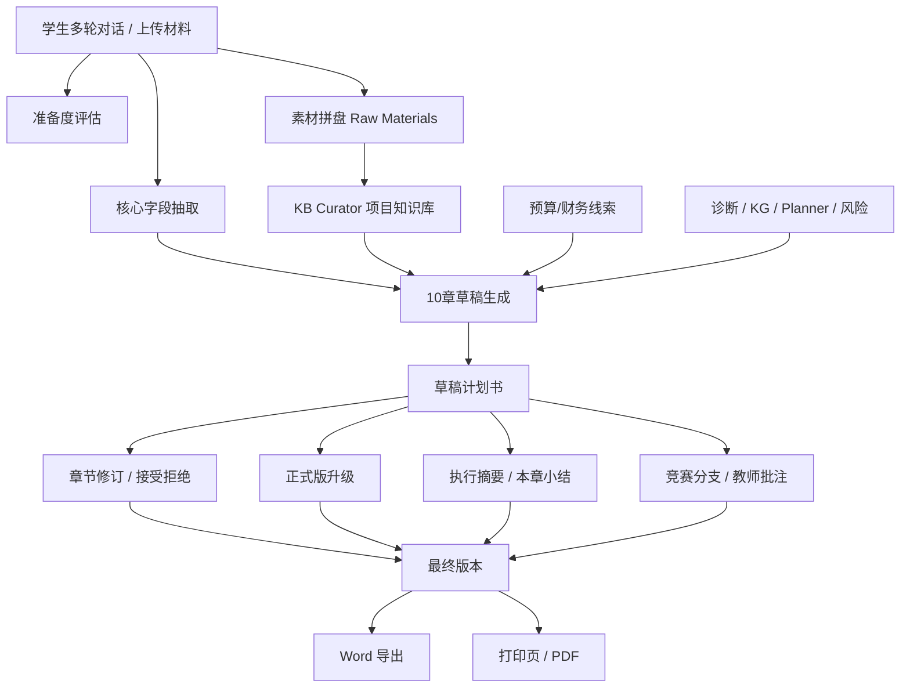
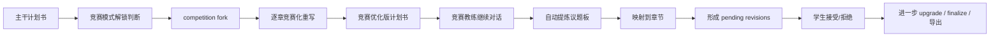

# 完整商业策划书生成与 Word 下载说明

本文专门说明本系统中的“完整商业策划书生成”模块，即：

> 系统如何基于前面多轮对话、多智能体分析、知识图谱、超图、财务线索与案例知识，自动生成一份可编辑、可升级、可导出的完整商业计划书，并支持 `Word(docx)` 下载。

这篇文档不再重复介绍多智能体、知识图谱和超图本身，而是重点解释它们**如何被计划书模块真正消费**，以及计划书模块为什么不是一个“单次生成文本”的简单按钮，而是一个完整的文档生产闭环。

---

## 一、模块定位：它不是单次 Prompt，而是一条文档生产流水线

商业策划书模块不是“拿当前一句话让 LLM 写个计划书”，而是把前面聊天系统里已经积累的成果重新组织成一份正式文档。

它的核心设计逻辑是：

1. 先判断项目信息是否成熟到可以写计划书。
2. 再从多轮对话和多智能体轨迹中抽取可复用素材。
3. 把这些素材蒸馏成一个结构化项目知识库 `knowledge_base`。
4. 基于统一的 10 章模板，先生成骨架版草稿。
5. 再允许章节级升级、深化、教师批注回灌、竞赛分支增强。
6. 最终以 `docx` 导出，形成可下载、可提交、可继续润色的文档。

因此，本模块更像一个**“文档编译器”**，而不是一次性聊天回答。

---

## 二、生成前置：不是随时都能写，而是先做“计划书准备度”判断

计划书生成入口并不会盲目放行，而是先调用 `get_readiness(project_id, conversation_id)` 判断当前项目是否已经具备成文条件。

### 2.1 系统看哪些槽位

系统重点检查 7 个核心信息槽位：

- 目标用户 `target_user`
- 痛点 `pain_point`
- 方案 `solution`
- 商业模式 `business_model`
- 市场与竞争 `market_competition`
- 财务逻辑 `finance_logic`
- 阶段计划 `stage_plan`

这意味着系统判断“能不能写计划书”，不是看学生写了多少字，而是看**计划书骨架有没有形成**。

### 2.2 准备度不是单个阈值，而是综合成熟度

准备度的成熟度 `maturity_score` 由三部分构成：

- 骨架完整度 `skeleton`
- 智能体信息密度 `agent_density`
- 逻辑自洽度 `coherence`

最终输出：

- `maturity_score`
- `maturity_tier`
- `maturity_breakdown`
- `maturity_next_gap`
- `suggested_questions`

也就是说，计划书模块不是“硬写”，而是先告诉前端：

> 当前材料是否足够写、还缺哪几块、下一步应该补什么问题。

### 2.3 为什么要先做这一层

这样设计有两个作用：

1. 避免学生只说一句模糊想法时就强行生成“空心计划书”。
2. 把“是否可生成”从主观感觉变成可解释的结构化判断。

---

## 三、输入来源：计划书不是只看当前输入，而是复用“上述成果”

这篇文档最重要的一点，就是讲清楚“基于上述成果”到底是什么意思。

在计划书模块里，上游成果主要来自五类输入：

| 输入来源 | 来自哪里 | 在计划书中的作用 |
| --- | --- | --- |
| 学生多轮原始对话 | `messages` | 提供最原始项目叙述 |
| 多智能体分析结果 | `agent_trace.role_agents` | 提供行动建议、结构判断、章节线索 |
| 知识图谱分析 | `kg_analysis` | 提供实体、洞察、结构缺口、市场线索 |
| 诊断与风险结果 | `diagnosis` | 提供瓶颈、规则、风险点 |
| 财务线索 | `budget_hint` | 支撑财务与融资章节 |

其中最核心的中间层有两步：

1. `_extract_core_fields()`  
   从最近多轮用户内容和最新 `agent_trace` 中提取“目标用户、痛点、方案、商业模式、市场、运营、财务、阶段计划”等核心字段。

2. `_harvest_raw_materials()`  
   把历史消息里的多智能体成果做聚合，形成“素材拼盘”。

### 3.1 素材拼盘里具体收了什么

`_harvest_raw_materials()` 会聚合：

- `user_turns`
- `assistant_turns`
- `planner_analyses`
- `diagnosed_risks`
- `kg_entities`
- `kg_insights`
- `proposed_tasks`
- `case_refs`

这一步非常关键，因为它说明计划书模块并不是只拿“最后一轮回答”来写，而是把整个辅导过程中的有效信息重新收集起来。

### 3.2 从“素材拼盘”到“项目知识库”

收集完素材后，系统会调用 `_build_knowledge_base()`，把这些原始材料蒸馏成统一 JSON：

- `project_core`
- `user_insights`
- `solution_design`
- `market_competitive`
- `business_economics`
- `operations`
- `risks_identified`
- `agent_consensus`
- `open_questions`

也就是说，计划书真正写作时并不是直接看乱序聊天记录，而是看一份统一的 `knowledge_base`。

这一步的意义很大：

> 前面的聊天结果是“过程数据”，而计划书生成要用的是“文档级知识底座”。

---

## 四、十章结构：系统不是自由发挥，而是有固定文档骨架

商业计划书采用固定的 10 章模板：

1. 项目概述 `overview`
2. 用户痛点与目标人群 `users`
3. 产品/服务方案 `solution`
4. 商业模式与价值主张 `business_model`
5. 市场与竞品分析 `market`
6. 核心优势与竞争壁垒 `advantage`
7. 运营与推广策略 `operations`
8. 财务与融资计划 `finance`
9. 当前风险与待验证假设 `risk`
10. 阶段目标与下一步行动 `roadmap`

每一章都预先定义了：

- `core_slots`
- `writing_points`
- `subheadings`
- `frameworks`

这意味着系统不是随便让模型“写 10 段话”，而是给每一章都规定：

- 这一章依赖哪些信息
- 这一章应该讲哪些点
- 这一章适合用什么分析框架

因此生成结果更像“真正的计划书章法”，而不是聊天总结。

---

## 五、草稿生成：先产出骨架版，而不是一上来写超长正式稿

### 5.1 为什么先写草稿

系统第一步生成的是 `draft`，不是正式版长文。

这是因为计划书生成需要兼顾：

- 速度
- 可编辑性
- 版本可对比
- 后续深化空间

所以系统先输出一份**10 章骨架版草稿**，让学生先读得通、改得动、决定是否继续升级。

### 5.2 草稿写作 Prompt 的核心思想

草稿阶段 `_generate_draft_sections()` 的写作原则是：

- 全程使用第三人称书面语
- 把 KB 当成唯一事实来源
- 有素材章节写 300-500 字
- 无素材章节也给出基于行业通用框架的 AI 参考稿
- 财务章必须明确判断财务合理性，不能只列数字

这说明草稿版虽然还不是正式版，但已经不是简单提纲，而是“可直接阅读的结构化骨架稿”。

### 5.3 有素材与无素材的区别

系统会先判断每章是否 `has_material`：

- 如果有足够素材，就写成正常章节
- 如果素材不足，就写成参考稿，并标记 `is_ai_stub = true`

这点非常适合写进说明书，因为它体现了系统的克制性：

> 对有证据的章节正常展开；对缺证据的章节不伪装成“已经写实”，而是明确标识为 AI 参考稿。

### 5.4 最短兜底

草稿生成后还会跑 `_ensure_draft_min_length()`：

- 如果某章过短
- 就用规则兜底文案补齐最低可读长度

因此即使 LLM 生成质量不稳定，系统也能保证整份计划书不会出现大量空章。

---

## 六、为什么说它是“基于上述成果”生成的

从代码上看，计划书模块至少复用了前面系统里的这几类成果：

### 6.1 复用对话内容

最近多轮学生输入会被提取成：

- 用户画像线索
- 痛点表达
- 方案描述
- 商业模式句子
- 阶段计划内容

### 6.2 复用多智能体结果

`agent_trace.role_agents.planner` 会被重新吸收；
`next_task`、`diagnosis` 也会回流进入计划书。

这意味着行动规划师、诊断引擎给出的阶段建议，并不会停留在聊天里，而会进入文档章节。

### 6.3 复用知识图谱结果

计划书模块会读取：

- `kg_analysis.entities`
- `kg_analysis.insight`

这会直接影响：

- 市场与竞争章节
- 风险章节
- 用户与方案章节的结构化表达

### 6.4 复用风险诊断结果

`diagnosis.triggered_rules` 和 `diagnosis.bottleneck` 会被计划书吸收，用于：

- 风险章
- 财务合理性判断
- 待验证假设

### 6.5 复用财务结果

系统会通过 `_load_budget_hint(student_id)` 读取学生的预算与财务记录，并把它注入：

- 草稿写作
- 正式版升级
- 财务与融资章节

因此财务章节并不是“凭空生成的财务文字”，而是建立在已有财务模块成果之上的。

---

## 七、版本机制：生成不是覆盖，而是“可修订、可接受、可拒绝”

这是本模块和普通“一键生成器”差别很大的地方。

### 7.1 首次生成与再次生成

首次生成时：

- 系统创建一份主干计划书 `plan_type = main`
- `version_tier = draft`

再次生成时：

- 系统不会直接粗暴覆盖原文
- 而是通过 `_build_revisions()` 比较旧章与新章
- 形成 `pending_revisions`

### 7.2 修订项里有什么

每条修订都会带：

- `section_id`
- `summary`
- `reason`
- `source_hint`
- `old_content`
- `new_content`
- `changes`

也就是说，系统并不是说“我替你改好了”，而是给出：

> 哪一章建议改、为什么改、旧文是什么、新文是什么、改动差异是什么。

### 7.3 用户可控的接受 / 拒绝

系统支持：

- 单条接受 `accept_revision`
- 单条拒绝 `reject_revision`
- 全部接受 `accept_all_revisions`
- 全部拒绝 `reject_all_revisions`

所以计划书不是一次性黑箱生成，而是一个**人机协同修订流程**。

---

## 八、从草稿到正式版：升级链路并不是简单“润色”

如果学生希望把草稿变成更像正式提交稿的文本，系统会走 `upgrade_plan()`。

### 8.1 升级分两档

- `basic`
- `full`

两档的差别主要在目标字数区间和论证深度上。

### 8.2 正式版升级会额外注入哪些东西

相比草稿阶段，升级阶段会额外引入：

1. **行业网页资料** `web_ctx`  
   每章按主题抓取行业背景与公开事实。

2. **同行业优秀案例 Few-shot** `case_header / case_per_section`  
   从本地结构化案例库中取同类优秀项目，只参考风格和深度，不允许抄袭事实。

3. **教师批注** `teacher_notes_by_sid`  
   教师端未解决的建议与问题会按章节回灌到升级 Prompt。

4. **章节补充内容** `chapter_addons`  
   单章深化得到的新信息也会注入升级流程。

### 8.3 升级 Prompt 的硬约束

正式版升级不是简单“写长一点”，而是明确要求：

- 每章达到指定字数区间
- 每章只用 2-3 个 `###` 小标题
- 每个小标题下至少有成体系段落
- 每章至少包含 3 个数字化指标
- 每章至少包含 1 个 Markdown 表格
- 每章显式使用 1 个分析框架

这非常适合写在说明书里，因为它能说明：

> 正式版生成是有学术化、竞赛化写作约束的，不是一般聊天式扩写。

### 8.4 升级仍然保留修订机制

升级后的新内容不会立刻强制覆盖，而是继续形成 `pending_revisions`。

这保证了两个特点：

- AI 可以大胆增强论证
- 用户仍然保留最终控制权

---

## 九、温和正式化：执行摘要与本章小结

除了整章升级，系统还支持 `finalize_plan()` 做“温和正式化”。

它主要做两件事：

1. 自动生成 / 更新 `执行摘要`
2. 为每章末尾追加 / 更新“本章小结”

这一步的价值在于：

- 把整份计划书的顶层叙事补完整
- 让每章收尾更像正式文档
- 适合在最终导出前做一次文档风格整理

因此，系统里实际上存在三层文档状态：

| 层次 | 作用 |
| --- | --- |
| 草稿版 `draft` | 快速成文，方便通读与补充 |
| 升级版 `upgrade` | 强化论证深度、表格、框架与数字 |
| 正式化 `finalize` | 增加执行摘要与章末总结，提升提交感 |

---

## 十、教师与竞赛链路：计划书不是孤立模块

商业计划书模块并不是学生端孤立使用，它还向教师端和竞赛模式继续延伸。

### 10.1 教师批注回灌

教师端可以对计划书做批注，学生后续升级章节时，未解决的：

- `suggestion`
- `issue`

会被重新注入升级 Prompt。

这意味着教师意见不是停留在界面层，而是能真实影响下一轮计划书生成。

### 10.2 为什么竞赛教练在这个模块里是关键角色

如果说普通计划书生成解决的是“把项目写出来”，那么竞赛教练解决的就是：

> 如何把一份已经能读的计划书，继续优化成更像评委会买账、能打分、能防守、能答辩的竞赛版本。

也就是说，竞赛教练在这里不是一个外围功能，而是计划书从“项目说明文”走向“竞赛提交稿”的核心推进者。

它起作用的方式不是单一的一次 Prompt，而是四步持续优化链：

1. 先判断当前计划书是否允许进入竞赛模式。
2. 再从主干计划书 fork 出独立的竞赛优化分支。
3. 以评委视角逐章重写内容。
4. 在后续对话中继续提炼“证据、量化、防守点、差异化、赛道匹配”等议题，并回灌到具体章节。

这意味着竞赛教练不是“生成前提建议”，而是**生成后继续接管文档优化**。

### 10.3 竞赛教练不是直接覆盖原稿，而是先“解锁 + 分支化”

计划书支持：

- 教练模式切换 `project / competition`
- 竞赛分支 fork
- 竞赛议题提取与应用

但代码里并不是用户一点击“竞赛模式”就强制重写全文。

系统先会通过 `set_coaching_mode()` 检查当前计划书的成熟度：

- 只有当 `maturity_tier` 达到 `basic_ready` 或 `full_ready`
- 才会把 `competition_unlocked` 置为 `true`

这背后的逻辑很合理：

> 如果项目还没有基本骨架，就不应该过早进入“评委视角优化”，否则只会把一份尚未成形的内容包装得更像成稿，而不是真正提高获奖概率。

即使切到竞赛模式，系统也尽量保留主干文档安全性。`fork_for_competition()` 会从主干计划书复制出一份新的竞赛优化分支：

- 新建 `plan_id`
- `plan_type = competition_fork`
- `fork_of = 原主干计划书`
- `mode = competition`
- `version_tier = full`

这说明竞赛教练的优化不是“把原稿改坏了就回不去”，而是：

> 以独立竞赛分支的方式继续打磨，主干计划书保持不动。

### 10.4 竞赛教练第一层作用：把普通章节改写成“评委视角章节”

创建竞赛分支后，系统会对每一章执行一次 `_competition_rewrite_section()`。

这一步不是一般润色，而是明确切换到“竞赛计划书口径”。Prompt 的核心要求包括：

- 保留原稿中的真实项目事实，不允许虚构
- 以评委视角补齐证据锚点
- 强调量化事实、差异化、防守点
- 把章节改写成可以直接提交竞赛评审的版本

这里竞赛教练注入的额外信息不是空泛建议，而是带着预学习结果进入章节改写：

1. **同赛道案例** `case_refs`  
   告诉模型优秀案例通常怎样呈现亮点。

2. **结构范式** `outline_patterns`  
   告诉模型竞赛文本常见的组织方式。

3. **证据线索** `evidence_patterns`  
   告诉模型哪些证据更像评委真正认可的证据。

4. **风险清单** `risk_patterns`  
   提前把评委最容易追问的漏洞暴露出来。

5. **图谱信号** `graph_signals`  
   包括风险规则、评分维度等结构化信号。

因此竞赛教练不是只说“请更有说服力”，而是具体把章节往下面这些方向推：

- 更有证据
- 更有数字
- 更有亮点结构
- 更能防守评委追问
- 更贴近具体赛事侧重点

### 10.5 竞赛教练第二层作用：不是一次改完，而是持续提炼“评委议题”

这一层恰恰是原文档里还不够突出的重点。

系统在竞赛模式下，会在每次助手回合完成后调用 `extract_agenda_from_message()`，自动把新一轮竞赛建议拆成 0-3 条“竞赛议题”。

也就是说，竞赛教练不是只在 fork 那一刻工作一次，而是在后续对话中继续盯着这份文档，持续问：

> 还有哪些地方从评委视角看，证据不够、量化不够、防守不够、差异化不够？

系统会自动给议题打 `jury_tag`，目前重点就包括：

- 证据
- 量化
- 防守点
- 差异化
- 赛道匹配

同时还会给出 `section_id_hint`，也就是：

- 这个议题应该优先落回哪一章

例如：

- “用户样本不够扎实”更可能回到 `users`
- “TAM/SAM/SOM 论证不清楚”更可能回到 `market`
- “收入模型缺少单位经济证明”更可能回到 `business_model` 或 `finance`
- “护城河不够能防守”更可能回到 `advantage`

这一步的意义非常大，因为它把竞赛教练从“会提建议”变成了“能给文档派工”。

### 10.6 竞赛教练第三层作用：把口头建议真正回灌成文档修订

议题被提取出来之后，并不会只停留在看板上。

`apply_agenda()` 会把选中的竞赛议题按章节分组，再把它们合并回对应章节，形成新的 `pending_revisions`。

它追加进去的不是一个抽象标签，而是类似这样的结构化补充块：

- 竞赛教练标签
- 议题标题
- 核心 gist
- 需要补的证据提示

因此，竞赛教练完成的是下面这个关键转化：

> 从“评委可能会追问什么”  
> 变成“计划书的哪一章应该加什么内容”

这就是为什么说它是在“继续优化生成的文档”，而不是停留在聊天建议层。

### 10.7 竞赛教练第四层作用：让计划书越来越像“可答辩文本”，而不是普通说明文

普通计划书生成更多是在回答：

- 你是谁
- 你解决什么问题
- 你怎么做
- 你怎么挣钱

而竞赛教练追加的优化，更多是在回答：

- 评委会不会相信你
- 你的数字能不能站住
- 你与竞品比到底强在哪
- 别人问你为什么赢、为什么现在做、为什么你来做时，你能不能接住

所以竞赛教练带来的不是“文风变化”这么简单，而是整份文档叙事重心的迁移：

- 从项目描述，迁移到评审说服
- 从一般商业逻辑，迁移到竞赛打分逻辑
- 从写给自己看，迁移到写给评委看

### 10.8 竞赛教练与升级链路是串联的，不是两套互不相干的系统

在代码里，竞赛教练与计划书升级链路并不是分开的：

1. 主干计划书先完成基础草稿生成。
2. 当成熟度达到门槛后，竞赛模式被解锁。
3. 系统 fork 出竞赛优化版计划书。
4. 竞赛教练逐章重写，形成第一批竞赛化修订。
5. 后续对话继续抽取竞赛议题板。
6. 议题再回灌成新的章节修订。
7. 学生再决定接受、拒绝、继续 upgrade 或 finalize。

因此竞赛教练不是计划书模块外面的“附加顾问”，而是计划书模块内部一个专门负责：

- 持续发现竞赛短板
- 持续把短板映射到章节
- 持续把章节往评委逻辑上推进

的深度优化角色。

### 10.9 一句话总结竞赛教练在此处的职责

如果要在最终说明书里用一句更凝练的话概括它的作用，可以直接写：

> 在商业策划书模块中，竞赛教练并不负责从零生成普通计划书，而是负责在主干文档形成后，以评委视角持续识别证据、量化、防守点、差异化与赛道匹配等竞赛关键议题，并将这些议题回灌到具体章节中，推动计划书从“可阅读”逐步升级为“可打分、可答辩、可获奖”的竞赛版本。

### 10.10 教师批注与竞赛教练的关系

教师批注和竞赛教练并不是冲突关系，而是两种不同来源的“优化驱动力”：

- 教师批注更像人工专家给出的定点修正
- 竞赛教练更像系统化、持续运行的评委视角增强器

两者都可以进一步进入升级 Prompt，因此计划书后续优化实际是：

- 教师意见回灌
- 竞赛议题回灌
- 正式版升级重写

三者叠加的结果。

所以计划书模块不仅是“文档生成器”，还是一个由竞赛教练持续驱动的**竞赛版文档增强系统**。

---

## 十一、Word 下载：后端是真正生成 `docx`

这是用户特别关心的一点：系统不是只做页面展示，而是真的支持 Word 下载。

### 11.1 后端导出接口

后端提供：

- `POST /api/business-plan/{plan_id}/export`
- `GET /api/business-plan/exports/{filename}`

前者负责生成导出文件，后者负责下载文件。

### 11.2 导出格式的实际情况

后端的 `export_plan()` 以 `python-docx` 为核心生成 `docx` 文件，说明：

- 计划书正文不是简单导出 markdown
- 而是重新排版成 Word 文档结构

它会处理：

- 页面边距
- 默认字体与字号
- 中文字体
- 标题样式
- Markdown 表格转 Word 表格
- 章节内容解析

也就是说，系统导出的不是“聊天记录存盘”，而是**版式化的正式 Word 文档**。

### 11.3 封面信息

导出时会合并 `cover_info`，包括：

- 项目名称
- 团队 / 作者
- 课程 / 班级
- 指导老师
- 日期

这说明 Word 导出不仅导正文，还会处理封面级信息。

### 11.4 导出产物

导出成功后会返回：

- `export_format`
- `file_name`
- `file_url`
- `cover_info`

前端接收到 `file_url` 后，会直接打开下载链接。

---

## 十二、PDF 支持的真实实现：重点是 Word 下载，PDF 走打印页

这里需要讲清楚一个很真实的实现细节。

### 12.1 Word 是后端直接生成

`docx` 是后端真实生成的文件，属于标准“服务端导出”。

### 12.2 PDF 不是主要导出通道

学生端前端里，`exportBusinessPlan("pdf")` 实际走的是：

- 打开 `/business-plan/[planId]/print?autoprint=1`
- 触发浏览器打印
- 用户在浏览器打印对话框里选择“另存为 PDF”

也就是说，前端的 PDF 更像：

> 打印视图导出

而不是服务端强制生成 PDF。

### 12.3 后端的 PDF 退化策略

后端虽然尝试过 `docx2pdf` 转换，但如果服务器没有：

- `docx2pdf`
- MS Word
- LibreOffice 运行环境

就会直接回退为 `docx` 下载，并明确返回提示。

因此，真正稳定的导出能力是：

- **Word(docx) 稳定可用**
- **PDF 主要通过打印页获得**

这也正好符合你这次文档标题里“支持 Word 下载”的重点。

---

## 十三、前端体验：用户看到的是“文档工作台”，不是单个按钮

学生端前端并不是只给一个“生成”按钮，而是一整套计划书工作流界面，包含：

- 加载最新计划书
- 生成计划书
- 刷新生成
- 章节编辑
- 修订接受 / 拒绝
- 升级正式版
- 批量接受 / 拒绝
- 深化提问
- 终稿 finalize
- 快照与回滚
- 竞赛分支切换
- 导出 docx
- 打印 / 导出 PDF

这说明产品层面对计划书的定位不是“单轮文本产物”，而是一个持续迭代的文档工作区。

---

## 十四、为什么这个模块成立：它把前面系统的“分析成果”真正转成“文档成果”

如果把整个系统分成两层：

- 上层：多智能体分析层
- 下层：正式文档生成层

那么商业计划书模块就是两者之间的桥梁。

它完成了一个关键转化：

> 把聊天里的洞察、诊断、图谱结果、风险判断、财务分析和教师意见，转化成一份结构稳定、可编辑、可导出、可提交的正式文档。

这也是为什么在最终说明书里，这一模块应该被表述为：

- 不是普通文本生成
- 而是“面向创业项目文档生产的结构化生成与修订系统”

---

## 十五、适合写进最终说明书的总结表述

如果这一篇要浓缩进最终说明书，可以直接采用下面这组表述：

1. 本系统中的商业策划书生成模块并不是单次对话式生成，而是建立在多轮学生输入、多智能体分析、知识图谱、风险诊断与财务线索之上的结构化文档生产链路。
2. 系统首先通过准备度评估判断项目是否具备成文条件，再从对话与 `agent_trace` 中提取核心字段、聚合原始素材，并蒸馏为统一的项目知识库 `knowledge_base`，作为后续写作的唯一事实底座。
3. 在写作层，系统采用固定的 10 章计划书模板，对每章预设写作要点、分析框架与所需核心槽位，先生成可编辑的骨架版草稿，再按需升级为更完整的正式版。
4. 在升级层，系统会进一步引入行业网页资料、同类优秀案例、教师批注与章节补充内容，对原草稿进行分章增强，并仍然以“待接受修订”的形式交由用户确认，从而保证人机协同而非黑箱覆盖。
5. 在导出层，系统支持服务端生成 `docx` 格式的 Word 商业计划书，并通过打印视图支持 PDF 输出，使分析成果最终能够沉淀为可提交、可答辩、可归档的正式文档。

---

## 十六、源码与接口定位

- 商业计划书主服务：`apps/backend/app/services/business_plan_service.py`
- 计划书 API：`apps/backend/app/main.py`
- 学生端计划书工作台：`apps/web/app/student/page.tsx`
- 打印 / PDF 视图：`apps/web/app/business-plan/[planId]/print/page.tsx`
