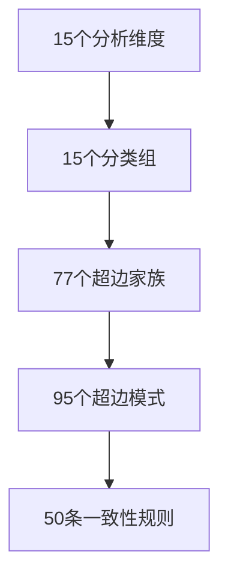

# 超图及评估说明

本文对应学生端顶部栏中的`超图 / 质量评估`面板。相比前一版，这一版重点讲清四件事：

1. 超图到底是什么层级结构，而不是只给出“有多少家族”。
2. 超图评估为什么不是普通图评估，而是“本体设计合理性审计”。
3. 前端看到的“设计合理性”与“运行期实例频次”分别说明什么。
4. 当前哪些部分已经很强，哪些部分仍值得继续扩展。

---

## 一、超图评估的大框架

知识图谱那一篇更强调 A-F 六维总框架；超图这边虽然评估对象不同，但本质上沿用的是同样的思想：  
不是只问“分高不高”，而是问“设计对不对、全不全、能不能解释、是不是服务创新创业任务”。

可以把超图评估整理成下面这张结构表：

| 评估维度 | 老师真正关心的问题 | 对应指标 | 当前结论 |
| --- | --- | --- | --- |
| A. 设计正确性 | 这些超边家族是不是有理论依据，不是随便拼出来的？ | `framework_alignment`、`orphan_families`、`orphan_patterns` | 理论映射完整，且没有孤儿家族 |
| B. 结构完整性 | 从维度到分类、家族、模式、规则，是否覆盖完整？ | `dimension_coverage`、`rule_coverage`、`family_coverage_by_patterns` | 覆盖非常高，15/15 维度、77 家族全被模式覆盖 |
| C. 映射可追溯性 | 一个模式为什么属于这个家族、这个家族为什么挂这些规则，能不能追到来源？ | `pattern_family_density`、`triple_mapping_health`、family->rule 映射 | 三元映射健康度很高，映射链条清晰 |
| D. 结构合理性 | 整体是否均衡？是否过于偏向某一类结构？ | `group_balance_entropy`、`group_gini`、`pattern_diversity`、`avg_pattern_arity` | 结构均衡度很高，典型多元超图而非普通二元图 |
| E. 任务代表性 | 这套超图是否覆盖“创新 -> 创业”的完整链条？ | `lifecycle_coverage`、四桶分布、实例家族频次 | 链条覆盖很强，但桥接层仍最值得继续补强 |
| F. 方法学透明性 | 这套超图评估有没有公开公式、承认边界？ | `score_formula`、各项公式说明、静态推导逻辑 | 方法透明，可复算，不依赖大模型主观打分 |

### 1.1 为什么超图不能只看“实例多不多”

因为超图这里其实有两个不同对象：

1. **静态本体设计**  
   回答“这套结构关系体系设计得好不好”。

2. **运行期实例激活**  
   回答“当前语料和学生项目实际触发了哪些家族”。

所以前端才会分两层展示：

- `catalog`：看静态设计
- `hypergraph-viz`：看当前实例

### 1.2 总流程图

```mermaid
flowchart LR
  A[15个分析维度] --> B[15个分类组]
  B --> C[77个超边家族]
  C --> D[95个超边模式]
  D --> E[50条一致性规则]
  C --> F[/api/hypergraph/catalog 静态合理性]
  D --> F
  E --> F
  C --> G[运行期匹配实例]
  G --> H[/api/kg/hypergraph-viz 家族频次]
  F --> I[超图/质量评估面板]
  H --> I
```

---

## 二、超图的真实规模与分层结构

## 2.1 静态本体规模

当前超图静态设计规模为：

| 层级 | 数量 |
| --- | ---: |
| 分析维度 | `15` |
| 分类组 | `15` |
| 超边家族 | `77` |
| 超边模式 | `95` |
| 一致性规则 | `50` |

这说明超图不是“几个 if-else 规则”，而是分成了完整的多层结构：



### 2.2 运行期实例规模

当前前端超图可视化展示的是运行期实例，其真实值为：

| 指标 | 当前值 |
| --- | ---: |
| 超边实例 | `362` |
| 超节点 | `168` |
| 风险规则节点 | `27` |
| Rubric 节点 | `9` |
| 链接数 | `3240` |
| 已出现家族数 | `45` |

---

## 三、前端为什么必须结构化展示

超图这部分如果只给一个总分，老师几乎无法判断它是否合理，所以前端必须至少按三层来拆：

1. 按分类组展示：说明“这套超图覆盖哪些结构问题”
2. 按家族展示：说明“当前哪些结构关系最常被触发”
3. 按生命周期四桶展示：说明“是否覆盖创新到创业的完整链条”

### 3.1 15 个分类组

当前 15 个分类组及其实例情况如下：

| 分类组 | 家族数 | 当前实例边数 | 解读 |
| --- | ---: | ---: | --- |
| 价值叙事与一致性 | `5` | `48` | 高活跃，说明系统很重视“项目说法和行动是否一致” |
| 用户-市场-需求 | `4` | `38` | 高活跃，说明用户与市场匹配是高频问题 |
| 风险、证据与评分 | `5` | `54` | 当前最活跃组，说明系统强依赖证据链与风险审计 |
| 执行、团队与里程碑 | `5` | `38` | 高活跃，说明执行断裂是常见问题 |
| 合规、监管与伦理 | `5` | `20` | 中等活跃，主要对应高监管项目 |
| 单位经济与财务结构 | `5` | `38` | 高活跃，说明财务逻辑在诊断中占据重要地位 |
| 产品差异化与竞争动态 | `7` | `50` | 高活跃，说明竞争与护城河判断很常见 |
| 增长、渠道与规模化 | `6` | `46` | 高活跃，说明渠道与规模化也是核心问题 |
| 生态与多方利益 | `5` | `18` | 中等活跃，适合平台型或多方协同项目 |
| 社会与ESG | `5` | `12` | 当前较低，但对公益/社会创新项目很重要 |
| 问题发现与需求洞察 | `5` | `0` | 静态设计存在，运行期尚未大规模激活 |
| 创意孵化与方案设计 | `5` | `0` | 同上 |
| 知识转化与产学研 | `5` | `0` | 同上 |
| 数据与技术验证 | `5` | `0` | 同上 |
| 用户体验与设计思维 | `5` | `0` | 同上 |

### 3.2 这一结果该怎么解释

最值得写进说明书的不是“哪些组高”，而是两点：

1. 高活跃组集中在：
   - 风险、证据与评分
   - 产品差异化与竞争动态
   - 价值叙事与一致性
   - 增长、渠道与规模化

2. 五个“创新侧”分组当前实例边为 `0`

这不表示设计失败，而更像说明：

- 静态本体已经把创新阶段结构预留出来了
- 但当前运行期匹配主要还是服务“创业项目诊断”和“竞赛式逻辑审计”

换句话说，**静态设计比当前实际使用更完整**。

### 3.3 高频家族与关键家族

当前实例频次最高的家族为：

| 家族 | 实例数 | 为什么重要 |
| --- | ---: | --- |
| `Risk_Pattern_Edge` | `18` | 高度通用，直接对应跨项目风险识别 |
| `Value_Loop_Edge` | `16` | 对应项目价值闭环，是创业分析主轴 |
| `User_Pain_Fit_Edge` | `12` | 反映需求与用户是否匹配 |
| `Evidence_Grounding_Edge` | `12` | 反映核心主张是否被证据支撑 |
| `Execution_Gap_Edge` | `10` | 反映落地计划是否断裂 |
| `Market_Competition_Edge` | `10` | 反映市场与竞争结构是否讲清 |
| `Pricing_Unit_Economics_Edge` | `10` | 反映定价与单位经济是否自洽 |
| `Rule_Rubric_Tension_Edge` | `10` | 反映风险规则与评分标准之间的张力 |
| `User_Journey_Edge` | `10` | 反映用户路径是否形成闭环 |

这里建议在文档里同时区分：

#### 高频家族

- `Risk_Pattern_Edge`
- `Value_Loop_Edge`
- `User_Pain_Fit_Edge`
- `Evidence_Grounding_Edge`

它们说明系统当前最常处理的仍然是创业项目中最通用的逻辑问题。

#### 关键家族

- `Pricing_Unit_Economics_Edge`
- `Rule_Rubric_Tension_Edge`
- `Execution_Gap_Edge`
- `Market_Competition_Edge`
- `Compliance_Safety_Edge`
- `Social_Impact_Edge`

它们不一定频次最高，但对老师最有解释价值，因为它们直接对应：

- 财务逻辑
- 评分依据
- 执行能力
- 竞争判断
- 合规风险
- 公益 / ESG 价值

---

## 四、生命周期四桶与任务代表性

后端把超图进一步压缩成四个生命周期桶：

- `innovation`：创新侧
- `bridge`：桥接侧
- `entrepreneurship`：创业侧
- `commons`：公共基座

### 4.1 当前四桶结果

| 桶 | 家族数 | 模式数 | 规则数 | 含义 |
| --- | ---: | ---: | ---: | --- |
| `innovation` | `20` | `75` | `9` | 问题发现、创意形成、技术验证、体验设计 |
| `bridge` | `12` | `79` | `10` | 知识转化、IP、创新到商业化的承接 |
| `entrepreneurship` | `25` | `88` | `19` | 市场、单位经济、增长、执行、生态 |
| `commons` | `20` | `79` | `12` | 风险、证据、合规、ESG、价值叙事等横切基础 |

### 4.2 这一层为什么重要

这一层其实回答的是：

> 这套超图是不是只覆盖项目分析的某一个片段，还是已经覆盖“创新 -> 创业”的完整链条？

当前结果说明：

- 创业侧和公共基座最强
- 创新侧静态设计也足够厚
- `bridge` 是当前最薄弱桶

这很有解释力，因为最难设计的本来就是桥接层：  
它必须把“创意 / 科研 / 技术”真正接到“商业化 / 护城河 / 竞争回应 / IP 转化”上。

---

## 五、把评估逻辑讲清楚

## A. 设计正确性

### A.1 老师关心什么

老师关心的是：

> 这些家族和模式是不是有理论来源？还是拍脑袋拼出来的？

### A.2 系统怎么测

这一层主要看：

- `framework_alignment.coverage`
- `groups_mapped / groups_total`
- `orphan_families_count`
- `orphan_patterns_count`

### A.3 当前结果

| 指标 | 当前值 |
| --- | ---: |
| 理论框架覆盖率 | `1.0` |
| 已映射分类组 | `15 / 15` |
| 孤儿家族数 | `0` |
| 孤儿模式数 | `6` |
| 孤儿模式与中性模式重合数 | `6` |

### A.4 如何解释

这一层最关键的结论是：

1. 全部 15 个分类组都能映射到明确理论来源：
   - Lean Canvas
   - BMC
   - Design Thinking
   - TRL
   - Triple Helix
   - COSO / ISO 31000
   - ESG / SDGs
   - Porter Five Forces
   - AARRR

2. `orphan_families = 0`
   说明没有任何一个家族是“设计出来却永远挂不上模式”的空壳。

3. `orphan_patterns = 6` 也不是坏信号，因为这 6 个模式全部与 `neutral` 模式重合，说明它们是故意保留的中性结构模式，而不是漏设计。

所以 A 维度应写成：

> 超图家族与模式具有明确理论来源，且不存在孤儿家族；当前少量未挂规则的模式主要属于中性保留模式，而非结构性缺陷。

---

## B. 结构完整性

### B.1 老师关心什么

老师关心的是：

> 从维度到分类、家族、模式、规则，这条链是不是完整？

### B.2 系统怎么测

| 指标 | 当前值 |
| --- | ---: |
| 维度覆盖率 | `1.0` |
| 已覆盖维度 | `15 / 15` |
| 规则覆盖率 | `0.9333` |
| 已覆盖规则维度 | `14 / 15` |
| 家族被模式覆盖率 | `1.0` |

### B.3 如何解释

这一层有两个很强的信号：

1. `15 / 15` 维度全部被模式覆盖  
   说明没有哪一个分析维度完全缺席。

2. `family_coverage_by_patterns = 1.0`  
   说明 77 个家族全部至少被一个模式覆盖。

唯一值得保留的提醒是：

- 规则层只覆盖了 `14 / 15` 维度
- 其中 `risk_control` 在规则维度频次中为 `0`
- `execution_step` 只出现 `1` 次

这意味着“规则系统”仍比“家族系统”更保守，后续还可以往更细的规则层扩展。

---

## C. 映射可追溯性

### C.1 老师关心什么

老师关心的是：

> 为什么这个模式会被归到这个家族？这个家族为什么又挂这些规则？中间链条清不清楚？

### C.2 系统怎么测

这一层核心看：

- `pattern_family_density = 0.2245`
- `triple_mapping_health = 0.9811`

### C.3 如何解释

这两个值一起看才有意义：

- `pattern_family_density` 不高，表示模式和家族并不是全连接的
- `triple_mapping_health` 很高，表示规则 -> 模式 -> 家族这条链并没有断裂

也就是说，系统追求的是：

- 映射稀疏
- 但链条完整

而不是“为了看起来覆盖很全，把所有模式都乱连到所有家族上”。

所以 C 维度的结论应写成：

> 当前超图映射是稀疏但健康的；它强调可解释的链式映射，而不是表面上的高连通。

---

## D. 结构合理性

### D.1 老师关心什么

老师关心的是：

> 整个超图本体是不是过于偏向某一类结构？是不是看起来很多，其实分布失衡？

### D.2 系统怎么测

| 指标 | 当前值 |
| --- | ---: |
| 组熵 | `0.9975` |
| 组基尼系数 | `0.0468` |
| 最小组大小 | `4` |
| 最大组大小 | `7` |
| 模式多样性 | `0.7899` |
| 平均模式阶数 | `3.59` |

### D.3 如何解释

这一层最能体现“为什么它是超图，而不是普通图”：

1. `avg_pattern_arity = 3.59`
   说明平均每个模式覆盖 3 个以上维度，属于典型多元关系，不是普通二元边。

2. `group_balance_entropy = 0.9975`
   接近完全平衡，说明 15 个分类组在家族数量上没有严重失衡。

3. `pattern_diversity = 0.7899`
   说明模式并不是只会描述理想情况，或者只会做风险判错，而是保留了：
   - `ideal`：53
   - `risk`：36
   - `neutral`：6

所以 D 维度的结论应写成：

> 当前超图本体在结构上高度均衡，且保留了理想模式、风险模式与中性模式三类角色，具有典型超图而非普通图的多元结构特征。

---

## E. 任务代表性

### E.1 老师关心什么

老师真正会问：

> 这套超图是否真的服务“创新创业项目分析”，还是只覆盖了一部分结构？

### E.2 系统怎么测

这一层核心看：

| 指标 | 当前值 |
| --- | ---: |
| 生命周期平衡熵 | `0.9776` |
| 非空桶率 | `1.0` |
| 桥接密度 | `0.8316` |
| 跨桶模板数 | `88` |
| 跨桶模板占比 | `0.9263` |
| 生命周期得分 | `0.9888` |
| 最薄弱桶 | `bridge` |

### E.3 如何解释

这里面最值得强调的不是高分本身，而是：

1. 四桶都是非空的  
   说明系统不是只覆盖创业后半段。

2. `cross_bucket_ratio = 0.9263` 很高  
   说明大多数模式并不只作用在单一阶段，而是能够跨阶段连接上下游逻辑。

3. `bridge` 是最薄弱桶  
   这是一个真实、可解释的薄弱点，而不是坏消息。因为最难设计的本来就是创新向创业过渡的承接层。

所以 E 维度的结论应写成：

> 当前超图已经较好覆盖创新到创业的完整链条，但桥接层仍是最值得继续扩展和细化的部分。

---

## F. 方法学透明性

### F.1 老师关心什么

老师会追问：

> 这套超图评估是不是可复算？是不是能说明白公式和来源？

### F.2 系统怎么做

超图评估这一层的优势在于，它几乎完全不依赖大模型主观打分，而是基于静态结构推导：

- 理论框架映射
- 维度覆盖率
- 组均衡度
- 模式多样性
- 规则覆盖率
- 模式-家族密度
- 三元映射健康度
- 生命周期链条覆盖

公式已经在后端显式写死：

`0.18×framework + 0.18×dim_cov + 0.12×group_balance + 0.08×pattern_diversity + 0.08×rule_cov + 0.10×pf_density + 0.14×triple_health + 0.12×lifecycle_score`

### F.3 如何解释

这意味着超图合理性不是“模型觉得它合理”，而是：

- 公式公开
- 中间指标公开
- 桶、组、家族、模式、规则的映射链公开

所以 F 维度的结论可以写成：

> 超图评估本质上是一套静态、可复算、可解释的本体审计方法，而不是大模型主观给出的结构美学评价。

---

## 六、当前结果总览表

| 维度 | 核心判断 | 当前结果 |
| --- | --- | --- |
| A 设计正确性 | 理论基础扎实，且无孤儿家族 | `framework_coverage 1.0`，`orphan_families 0` |
| B 结构完整性 | 维度、家族、模式三层完整 | `15/15 维度`，`77 家族全被模式覆盖` |
| C 映射可追溯性 | 稀疏但健康，链条清晰 | `pattern_family_density 0.2245`，`triple_mapping_health 0.9811` |
| D 结构合理性 | 高度均衡，典型多元超图 | `group_entropy 0.9975`，`avg_pattern_arity 3.59` |
| E 任务代表性 | 基本覆盖创新到创业链条，但桥接层最薄弱 | `lifecycle_score 0.9888`，`weakest_bucket = bridge` |
| F 方法学透明性 | 公式公开，可复算，不依赖模型自评 | `score_formula` 显式可见 |

### 6.1 总分及其含义

当前超图设计合理性总分为：

- `0.896`，即前端显示约 `90%`

这个分数更适合解释为：

> 这套超图本体在结构设计上已经相当成熟，尤其在理论映射、维度覆盖、链条覆盖和三元映射健康度上表现很强；相对仍值得继续扩展的是桥接层与少量中性模式的进一步落地。

---

## 七、与大模型的关系

### 7.1 大模型不负责给超图打分

超图合理性评估这部分基本不依赖大模型主观判断。  
它主要靠的是：

- 静态本体设计
- 规则和家族映射
- 公式化结构统计

### 7.2 大模型负责消费超图

大模型更主要的作用出现在下游：

- 读取超图家族和规则命中
- 把结构问题转成 Analyst / Coach / Planner / Advisor 的上下文
- 把抽象结构诊断翻译成学生能理解的自然语言分析

所以更准确的表述是：

> 大模型是超图结构的使用者，而不是超图设计评估的裁判。

---

## 八、适合写进最终说明书的结论

如果这一篇要压缩成最终说明书中的几句结论，建议直接写成下面这组判断：

1. 当前超图采用`15维度 -> 15分类组 -> 77家族 -> 95模式 -> 50规则`的分层设计，是一套完整的结构本体，而非零散规则库。
2. 超图评估采用六类核心问题框架：设计正确性、结构完整性、映射可追溯性、结构合理性、任务代表性、方法学透明性。
3. 其中最强的是理论框架对齐、维度覆盖、三元映射健康度和生命周期链条覆盖；最值得继续扩展的是桥接层与少量中性模式的进一步落地。
4. 当前运行期实例主要集中在风险、价值闭环、用户痛点匹配、证据锚定、竞争与财务相关家族上，说明系统优先覆盖了创业项目中最常见、最关键的结构问题。
5. 从方法论上看，超图评估强调“静态本体可解释性”，而大模型主要负责在运行期消费这些结构结果，并将其转译为可读分析。

---

## 九、源码与接口定位

- 前端面板：`apps/web/app/knowledge/KBGraphPanel.tsx`
- 超图目录接口：`/api/hypergraph/catalog`
- 超图可视化接口：`/api/kg/hypergraph-viz`
- 超图设计合理性计算：`apps/backend/app/services/hypergraph_service.py`
- 接口入口：`apps/backend/app/main.py`
