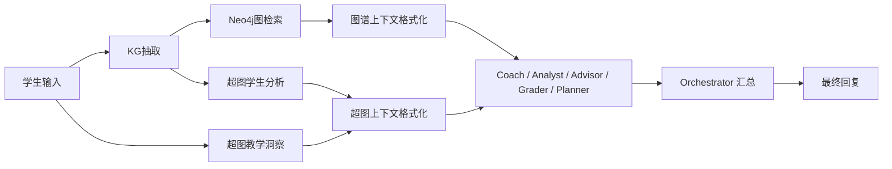

# 知识图谱与超图在使用过程中的引用正确性说明

本文不再讨论“知识图谱评得怎么样”或“超图设计得怎么样”，而是专门回答运行时的一件事：

> 当系统真正开始回答学生问题时，知识图谱和超图是如何被检索出来、如何被正确引用、又被送给哪些智能体使用的？

这篇文档重点解决三类问题：

1. **检索通道**：知识图谱 / 超图有哪些进入主链路的通道？
2. **引用正确性**：系统怎样避免把图谱/超图结果乱编进回答？
3. **下游接收者**：这些结果最后输入给了哪些 Agent / 模块？

---

## 一、总览：不是“检索一次就直接回答”

在主链路 `graph_workflow.py` 中，知识图谱和超图都不是“检索后直接贴给学生”的，而是经过了三层处理：

1. **检索 / 抽取层**  
   从学生文本、历史对话、Neo4j、超图库中拿到结构化结果。

2. **格式化 / 过滤层**  
   把结果改写成针对不同 Agent 的上下文字符串，避免信息过载和误引用。

3. **综合 / 编排层**  
   由 Coach / Analyst / Advisor / Planner / Orchestrator 等模块使用，并受一组明确的引用约束控制。

---

## 二、主链路里的四条检索通道

如果只看运行时真正会进入分析链的通道，可以概括成四条：

| 通道 | 数据来源 | 触发条件 | 产物 | 主要作用 |
| --- | --- | --- | --- | --- |
| 通道 1：KG 抽取 | 学生本轮文本 + 历史对话 | 文本够长、是项目相关问题或上传文件 | `kg_analysis` | 抽出当前项目的实体、关系、缺口、优势 |
| 通道 2：Neo4j 图检索 | Neo4j 知识图谱 | 至少 2 个有效实体、且是项目意图 | `neo4j_graph_hits` | 找跨项目相似结构、共享节点、互补结构 |
| 通道 3：超图教学洞察 | 超图库 | 只要是项目相关 intent 基本就会跑 | `hypergraph_insight` | 给出家族级、教学级的结构启发 |
| 通道 4：超图学生分析 | 当前学生项目的 KG 实体 / 关系 | 项目较成熟，或实体达到阈值 | `hypergraph_student` | 判断闭环、缺失维度、一致性问题 |

这一点非常重要：  
**知识图谱和超图不是同一种东西，也不在同一个时机被调用。**

- 知识图谱更像“当前项目与案例库的结构化索引”
- 超图更像“结构模式分析器”

---

## 三、通道 1：知识图谱抽取是如何做的

### 3.1 输入来源

KG 抽取节点 `_task_kg()` 的输入不是只有“学生这一句话”，而是：

- 学生本轮内容
- 最近多轮对话摘要
- 历史已经抽出的实体与关系

因此它不是一次性盲抽，而是有上下文记忆的增量抽取。

### 3.2 抽取结果长什么样

`kg_analysis` 至少包含这些内容：

- `entities`
- `relationships`
- `structural_gaps`
- `content_strengths`
- `completeness_score`
- `section_scores`
- `student_identity`
- `insight`

这说明 KG 抽取不只是“抽实体”，还会同步给出：

- 结构缺口
- 内容优势
- 完整度评分
- 分维度评分

### 3.3 引用正确性的第一层：source_span

KG 抽取完成后，代码会继续给实体补充可追溯信息：

- `source_span.quote`
- `source_span.offset`
- `source_span.length`
- `extraction_rule`

也就是说，系统会尽量把实体重新锚回学生原文位置。

这一步的意义是：

> 后续任何基于 KG 的判断，都至少可以说明“这个实体是从学生原话哪一段抽出来的”，而不是凭空归纳。

### 3.4 正确性约束

KG 抽取阶段已经内置两条重要约束：

1. **尽量全面提取**，避免过早漏掉实体。  
2. **未命中原文的实体会标记为 `llm_inferred`**，说明它是推断而不是原文直接命中。

所以系统并没有把“推断实体”和“原文实体”混成一个层次。

---

## 四、通道 2：Neo4j 图检索是如何做的

这条通道是“引用正确性”里最关键的一条，因为它负责把当前学生项目和历史项目案例连接起来。

## 4.1 触发条件

Neo4j 图检索不会无条件运行，而是至少满足：

- 是项目相关意图
- 当前有效累计实体数 `>= 2`

也就是说，系统不会在学生只说一句模糊想法时，就强行做跨项目图检索。

## 4.2 三种检索策略

`search_by_dimension_entities()` 里明确用了三种互补策略：

### 策略 1：共享节点 fan-out

寻找“其他项目也连接到了同一个维度节点”的情况。

例如：

- 同样的痛点
- 同样的商业模式
- 同样的市场结构

这回答的是：

> 谁也在处理和你相同的问题？

### 策略 2：结构互补检索

如果学生已有某些维度，但另一些关键维度还缺失，就找那些“结构更完整”的项目。

例如：

- 学生有 `pain_point`，但缺 `business_model`
- 学生有 `solution`，但缺 `evidence`

这回答的是：

> 哪些项目可以作为“补链条”的参考？

### 策略 3：关键词兜底

当前两种更结构化的方法召回不够时，再退回到基于关键词的匹配。

这回答的是：

> 在结构搜索不够充分时，至少还能找到文本上相近的案例。

## 4.3 返回结果里有哪些“正确引用”字段

`neo4j_graph_hits` 不是只返回项目名，而是带着以下结构：

- `project_id`
- `project_name`
- `category`
- `matched_dimensions`
- `matched_nodes`
- `match_sources`
- `retrieval_channel = "graph"`
- `context`

其中最关键的是：

### `match_sources`

明确区分命中来源：

- `shared_node`
- `complement`
- `keyword`

这意味着系统并不是只说“找到了相似项目”，而是知道：

- 是因为共享节点命中的
- 还是因为互补结构命中的
- 还是仅仅关键词相似

### `context`

还会附上该项目的局部结构内容，例如：

- `pains`
- `solutions`
- `innovations`
- `biz_models`
- `evidences`

因此下游 Agent 引用时不是只引用“项目名”，而是能引用“项目里具体哪种做法”。

## 4.4 格式化层：为什么要 `_fmt_graph_hits_ctx()`

所有 `neo4j_graph_hits` 不会直接原样塞给大模型，而是统一经 `_fmt_graph_hits_ctx()` 格式化成一段明确用途的上下文：

它会把每个命中项目整理成：

- 项目名
- 类别
- 匹配维度
- 匹配来源
- 痛点 / 方案 / 创新 / 商业 / 证据

而且标题直接写成：

> `知识图谱跨项目启发（请在回答中引用这些案例的做法来启发学生）`

这其实就是一条显式引用约束：

> 图谱结果不是拿来“报项目名单”的，而是拿来“引用具体做法”。

---

## 五、通道 3：超图教学洞察是如何做的

### 5.1 它是什么

`hypergraph_insight` 来自 `_hypergraph_service.insight(...)`。

它不是针对当前学生项目做精细闭环分析，而是更偏“教学启发”和“案例家族信号”。

### 5.2 它的输入

主要基于：

- 类别 `category`
- 规则 `rule_ids`
- 偏好边类型 `preferred_edge_types`

所以这条通道更像“从超图库里取教学线索”，而不是直接审学生项目本身。

### 5.3 它的作用

这条通道的主要职责是：

- 给当前问题补充家族级启发
- 告诉系统哪些超边类型更值得被关注
- 给探索期项目提供“结构方向”

### 5.4 正确引用性

超图教学洞察不会直接变成最终话术，而是先被 `_fmt_hyper_for_agent()` 按角色重写后再输入给不同 Agent。

这意味着：

- Coach 看到的是“未闭合逻辑环、可追问问题、价值链路”
- Analyst 看到的是“风险模式、一致性风险、关键缺失”
- Advisor 看到的是“闭环完成度、竞赛关键闭环缺失”

也就是说，**同一份超图结果不会被所有智能体一股脑照搬**。

---

## 六、通道 4：超图学生分析是如何做的

### 6.1 触发条件

`hypergraph_student` 只有在项目信息达到一定成熟度时才运行，例如：

- 项目成熟度被判定为 `mature`
- 或累计实体数 `>= 5`
- 或累计实体数 `>= 3` 且槽位较全

这说明系统并不会在信息极少时就强行做重超图诊断。

### 6.2 输入来源

`analyze_student_content()` 的输入是：

- `entities`
- `relationships`
- `structural_gaps`
- `category`

也就是说，超图学生分析不是直接读原文，而是建立在 KG 抽取结果之上。

因此流程是：

### 6.3 它输出什么

`hypergraph_student` 典型会输出：

- `coverage_score`
- `template_matches`
- `consistency_issues`
- `pattern_warnings`
- `missing_dimensions`
- `value_loops`

这是一套“结构正确性”输出，而不是自然语言评论。

### 6.4 正确引用性

这条通道的正确性，来自它始终建立在：

- 当前项目抽取出的实体 / 关系
- 超图模板匹配结果

之上，而不是自由生成。

因此它更像“结构检查器”，而不是“自由评论器”。

---

## 七、四条通道之间如何桥接

系统里还有两条特别重要的桥接逻辑，它们决定了检索结果不会彼此孤立。

## 7.1 Graph → RAG bridge

如果 Neo4j 图检索到了项目，但这些项目还没进入 RAG 案例上下文，系统会再尝试把这些项目桥接进 `rag_cases`。

这一步的意义是：

- 图检索负责“找结构上相近的项目”
- RAG 负责“把这些项目转成更完整的案例文本上下文”

因此最终下游 Agent 能同时看到：

- 图结构命中
- 案例文本上下文

而不是只看到一个项目 ID。

## 7.2 Hyper-driven RAG boost

如果 `hypergraph_student` 发现某些高重要维度缺失，而且覆盖分偏低，系统会反过来用“缺失维度关键词”去补跑 RAG。

例如缺：

- `evidence`
- `market`
- `business_model`
- `competitor`

就会追加相应关键词去补检索。

这一步很重要，因为它说明：

> 超图不是只做诊断，还会反过来指导知识检索补齐缺口。

---

## 八、这些结果最后输入给谁

这部分是用户最关心的“输入给谁之类的”。

## 8.1 维度写手 `_write_dimension()`

所有维度写手都会先走 `_build_dim_context()`，拿到：

- KG 洞察
- 诊断瓶颈
- 结构缺口
- 项目优势
- RAG 案例
- 图谱跨项目启发
- 超图教学启发
- 近期对话

而且系统提示词里明确写着：

> 如果背景信息中有「知识图谱跨项目启发」，你必须至少引用其中一个案例的具体做法来对比或启发学生。

这是一条非常强的代码级引用约束。

## 8.2 Coach

`_coach_analyze()` 会吃进去：

- `kg_analysis`
- `rag_context`
- `rag_enrichment_insight`
- `neo4j_graph_hits`
- `hypergraph_student`
- `hypergraph_insight`
- `history_knowledge_ctx`

其中：

- KG 负责给当前项目结构概览
- Neo4j / RAG 负责给跨项目对比
- Hypergraph 负责给结构性闭环和缺口提示

## 8.3 Analyst

`_analyst_analyze()` 会吃进去：

- `kg_analysis`
- `hypergraph_student`
- `hypergraph_insight`
- `web_search_result`
- `rag_context`
- `neo4j_graph_hits`
- `coach_output`

它是最典型的“多通道联合使用者”。

## 8.4 Advisor

`_advisor_analyze()` 会吃进去：

- `rag_context`
- `rag_enrichment_insight`
- `coach_output`
- `hypergraph_student`
- `neo4j_graph_hits`
- `rubric_breakdown`

它更偏竞赛语境，因此超图在这里主要用于“闭环完成度”和“竞赛关键闭环缺失”。

## 8.5 Grader

`_grader_analyze()` 会吃进去：

- `kg.section_scores`
- `hypergraph_student`
- `advisor_output`
- `neo4j_graph_hits`

也就是说，评分官不是只看 Rubric，还会看：

- KG 的分维度信号
- Hypergraph 的结构闭环信号
- 图谱跨项目参照

## 8.6 Planner

`_planner_analyze()` 会吃进去：

- `kg.entities`
- `kg.structural_gaps`
- `kg.content_strengths`
- `hypergraph_student / hypergraph_insight`
- `neo4j_graph_hits`
- `coach_output`

因此 Planner 能把“结构缺口”直接转成“本周任务”。

## 8.7 Orchestrator

Orchestrator 本身不重新检索，但会吃进去所有上游 Agent 已经产生的分析素材。

它的职责不是新增事实，而是：

- 重组顺序
- 组织表达
- 保留争议与低置信标记
- 把已有图谱/超图启示转成最终对学生有用的判断

---

## 九、系统怎样保证“引用正确”

这是本文最关键的一节。

## 9.1 不允许直接引入不存在的新事实

Orchestrator 的系统提示词明确写了：

- 不能引入分析结论中不存在的新事实、新判断或新数据
- 不能推翻任何分析师的主结论

这意味着最终回答层本身没有权限乱补“图谱里可能有”“大概类似于”的内容。

## 9.2 图谱启发必须转成“具体做法”，不能只报名称

维度写手提示词明确要求：

- 如果有知识图谱跨项目启发，必须至少引用一个案例的具体做法
- 不能泛泛说“其他项目”“类似项目”

因此系统不是让模型说：

> 我找到了相似案例。

而是要求它说：

> 类似的某个项目把痛点锁定在 XX，再用 YY 方式验证，所以你也可以……

## 9.3 超图上下文按角色裁剪，避免误用

`_fmt_hyper_for_agent()` 按角色输出不同内容：

- Coach：未闭合逻辑环、可追问问题、价值链路
- Analyst：风险模式、一致性风险、关键缺失
- Advisor：竞赛关键闭环缺失、覆盖分
- Planner：待补维度、行动线索

所以 Planner 不会拿到一整套 Analyst 风格风险诊断，Advisor 也不会直接拿到过长的执行建议。

这其实也是“引用正确性”的一部分：  
**不是只有事实对不对，还包括“谁该看什么”对不对。**

## 9.4 KG 实体带 `source_span`

KG 实体在抽取后会尽量补：

- `quote`
- `offset`
- `length`
- `extraction_rule`

这意味着后续如果教师端或调试端要追问“这个实体从哪来”，系统是有位置锚点的。

## 9.5 图检索结果带 `match_sources`

Neo4j 图检索命中还会区分：

- `shared_node`
- `complement`
- `keyword`

因此后续如果要解释“为什么引这个案例”，系统可以说明：

- 是共享节点命中的
- 是结构互补命中的
- 还是关键词兜底命中的

这就避免了“引用案例但说不清为什么引用”的问题。

---

## 十、推荐在正式说明书里怎么写

如果这一篇要压缩成最终说明书中的正式表述，建议直接写成下面这组判断：

1. 本系统中的知识图谱与超图都不是“检索一次直接贴回答”，而是遵循“检索 -> 格式化 -> 分角色注入 -> Orchestrator 汇总”的分层使用流程。
2. 知识图谱主要负责当前项目实体抽取、跨项目结构检索与案例补充；超图主要负责结构闭环判断、缺失维度识别和一致性风险分析。
3. 系统通过 `source_span`、`match_sources`、角色化上下文格式化以及 Orchestrator 的 anti-hallucination 约束，共同保证“引用必须可追溯、可解释、不可乱编”。
4. 不同 Agent 接收的图谱/超图信息并不相同，而是按功能定向裁剪：Coach 更看引导，Analyst 更看风险，Advisor 更看竞赛闭环，Planner 更看行动缺口。
5. 因此，知识图谱与超图在系统中并不是背景装饰，而是被显式纳入 Prompt 编排、案例检索与最终回答约束的核心结构输入。

---

## 十一、源码与接口定位

- 主编排链路：`apps/backend/app/services/graph_workflow.py`
- 轻量案例检索：`apps/backend/app/services/case_knowledge.py`
- 图检索实现：`apps/backend/app/services/graph_service.py`
- 超图实现：`apps/backend/app/services/hypergraph_service.py`
- 前端展示：`apps/web/app/knowledge/KBGraphPanel.tsx`
