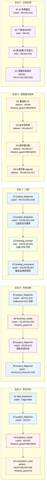

# 测试用例与结果分析

> 本文档是第 8 篇交付说明书的“实证”部分。  
> 上述 7 篇侧重「系统是怎么设计/实现的」，本篇回答「这套系统对真实对话，是否真的按设计那样反应」。  
> 所有测试 **都在真实后端 + 真实大模型** 上完成，账号 `654321` 登录后即可在学生端看到全部 5 个会话，并逐条展开智能体轨迹。

---

## 0. 测试目的与方法

### 0.1 目的

1. 覆盖说明书中最关键的三条链路：  
   - 项目诊断主流程（分流 → 信息收集 → 多 Agent 辩论 → Critic → 下一步任务）；  
   - 财务智能体 `finance_guard / finance_analyst` 的“会话内主动干预”；  
   - 竞赛模式 `competition` 下的教练 / 评委角色切换。
2. 用 **3 类不同定位的真实项目**（商业创业、科技创新、公益）逐轮叠加细节，观察系统能否随着信息积累逐步升级诊断结论、调用更多模块、给出更具体的下一步任务。
3. 针对大纲里的 **测试用例 3（答辩模式毒舌评委）** 与 **测试用例 9（合规与伦理）** 做专题对抗测试，并在同一会话内跟大模型讨论“还应该补哪些专家角色”“还应该补哪些合规自检项”。
4. 所有对话结果 **可在 654321 账号下打开项目回看**，保证可复现、可审阅。

### 0.2 方法

- 全程通过后端 HTTP API（`POST /api/dialogue/turn`）驱动对话，不依赖前端 UI，避免浏览器自动化的不稳定。
- 每个会话固定 `student_id = 1120233400`（即 654321 账号的 `user.student_id`），`project_id` 形如 `test-654321-*`，同一会话所有轮共用一个 `conversation_id`，构成真实多轮对话。
- 每轮结束后会把后端 `data/conversations/<project_id>/<conv_id>.json` 拷贝到本仓库 [`agent-explanations/_test_artifacts/`](./_test_artifacts/) 下，作为原始证据留档。
- 关键字段（`agent_trace.orchestration.pipeline / intent`、`agent_trace.diagnosis.triggered_rules`、`agent_trace.finance_advisory`、`agent_trace.kg_analysis`、`hypergraph_insight`、`next_task`）通过抽取脚本 [`_extract.ps1`](./_test_artifacts/_extract.ps1) 生成 [`*.extracted.json`](./_test_artifacts/) 便于对照分析。

### 0.3 术语速查

| 缩写 | 含义 |
| --- | --- |
| H3/H5/H8/H11/H14/H17/H23/H25 等 | 教学知识图谱里的风险规则编号，详见 [知识图谱及评估说明](./knowledge-graph-and-evaluation.md) |
| `finance_advisory.triggered` | 财务智能体是否在本轮介入（命中单位经济 / 定价 / 融资阶段等信号） |
| `pipeline = coach / tutor / advisor` | 主 Agent 人格：coach=创业教练，tutor=课堂助教，advisor=竞赛教练 |
| CPB | Cost Per Beneficiary，公益项目的“单位受益人成本” |

---

## 1. 测试环境

| 项 | 值 |
| --- | --- |
| 后端端点 | `http://127.0.0.1:8037` |
| 账号 | email `654321` / 密码 `654321` |
| 账号用户 ID | `0cfb36f4-db33-4cab-b7cb-6258204c454e` |
| 写入的 `student_id` | `1120233400`（与前端 `studentId` 规则一致，见 `apps/web/app/student/page.tsx` 第 2621 行） |
| 模型 | 后端默认 LLM 配置（未改动 `.env`） |
| 对话持久化目录 | `data/conversations/<project_id>/<conv_id>.json` |
| 证据产物 | `agent-explanations/_test_artifacts/<Label>.conversation.json`（每个会话的全量对话）+ `*.extracted.json`（结构化摘要） |

如需在前端回看：

1. 登录 `654321 / 654321`；
2. 前端会自动把当前项目设为 `project-0cfb36f4-db33-4cab-b7cb-6258204c454e`（账号默认项目，规则见 `apps/web/app/student/page.tsx` 第 2620 行）；
3. 打开左侧「会话列表」，可直接看到本文档涉及的 5 条测试会话（标题均以 `[测试A]…[测试E]` 开头）：
   - `[测试A] 商业创业 · 教育SaaS 课程班`（`e08ec68b-…`）
   - `[测试B] 科技创新 · 独居老人跌倒检测`（`bfeb4791-…`）
   - `[测试C] 公益项目 · 乡村英语领读`（`2fc092cb-…`）
   - `[测试D] 竞赛答辩 · 毒舌VC/技术/银行家`（`3a8a98d0-…`）
   - `[测试E] 合规与伦理 · AI偏见/隐私/准入`（`a32b315a-…`）
4. 点击任意会话即可看到 4 轮对话；展开每条 assistant 消息后可以看到 KG / 超图 / 诊断 / 财务诊断等 agent_trace。

> 备注：测试执行时为了把 5 个会话相互隔离，原始 `project_id` 使用了 `test-654321-*` 前缀；报告完成后，5 个会话文件已同时拷贝到账号默认项目目录 `data/conversations/project-0cfb36f4-db33-4cab-b7cb-6258204c454e/`，并把内部 `project_id` 字段改写为账号默认项目 ID，这样登录后不需要切换项目就能直接看到（原 `test-654321-*` 目录也仍保留作为原始证据）。

---

## 2. 测试用例总览

| 会话 | 类别 | 触发目标 | `project_id` | `conversation_id` | 模式 | 轮数 |
| --- | --- | --- | --- | --- | --- | --- |
| A | 项目测试 1：商业创业（AI 简历 SaaS） | LLM 路由 → coach → finance_guard → competition_prep | `test-654321-proj-edu-saas` | `e08ec68b-b940-413d-a91f-54b3bc73f7d7` | coursework | 4 |
| B | 项目测试 2：科技创新（独居老人跌倒检测） | coach → H11 合规伦理主线 → BOM 成本校验 | `test-654321-proj-eldercare-ai` | `bfeb4791-0ca4-419a-82c8-1ba7f95fe4c6` | coursework | 4 |
| C | 项目测试 3：公益（乡村英语绘本 AI 领读） | is_nonprofit 分支 / CPB 单位成本 / 资助阶段 | `test-654321-proj-rural-reading` | `2fc092cb-ab94-4529-b635-a1a4b23937cd` | coursework | 4 |
| D | 测试用例 3：竞赛毒舌答辩（互联网+） | `mode=competition`, `competition_type=internet_plus`，advisor 连续 4 轮 | `test-654321-testcase3-defense` | `3a8a98d0-6fe6-49f7-b410-23894adf05a8` | competition | 4 |
| E | 测试用例 9：合规与伦理自检 | AI 偏见 / 个保法 GDPR / 行业准入 / 竞赛自检 | `test-654321-testcase9-ethics` | `a32b315a-d91f-41dd-b0ff-fa899d80dfe2` | coursework | 4 |

### 2.1 会话 × 关键触发模块 全景图

读图方式：

- 蓝色=`coach`（创业教练）、绿色=`tutor`（课堂助教，`intent=learning_concept / company_operations` 时进入）、橙色=`advisor`（竞赛教练）、红色=本轮叠加 `finance_guard` 干预、紫色=触发合规伦理主线。
- 连线表示会话内的轮次顺序。每个节点下方已标注本轮命中的主要风险规则。

---

## 3. 会话 A / B / C —— 三个项目测试

### 3.1 会话 A：商业创业 · AI 大学生简历 SaaS

- 项目 ID：`test-654321-proj-edu-saas`
- 原始对话：[`A.conversation.json`](./_test_artifacts/A.conversation.json)
- 抽取摘要：[`A.extracted.json`](./_test_artifacts/A.extracted.json)

#### 3.1.1 用例设计

我们刻意从“一句话想法”开始，每一轮只补一类信息，观察系统是否会按设计从「头脑风暴」→「项目诊断」→「商业模式」→「竞赛准备」逐步升级：

| 轮 | 我们补的信息 | 触发预期 |
| --- | --- | --- |
| 1 | 一句话"做一个 AI 帮大学生写简历的平台" | `idea_brainstorm`，不诊断、只发散 |
| 2 | 补目标用户、产品形态、核心差异 | `project_diagnosis`，开始给出风险 |
| 3 | 补 9.9/29.9 定价、CAC=15、LTV=120、转化率、留存 | `business_model` + `finance_guard` 介入 |
| 4 | 主动问"TAM/SAM/SOM + 互联网+ 成熟度" | 进入 `competition_prep`，advisor 接管 |

#### 3.1.2 实际观察

| 轮 | `intent / engine` | `pipeline` | `stage` → `score_band` / `overall` | `triggered_rules` | `finance_advisory` | `next_task` |
| --- | --- | --- | --- | --- | --- | --- |
| 1 | `idea_brainstorm` / `llm` | `coach` | `idea` / — | — | — | 描述你的项目（目标用户、想解决的问题） |
| 2 | `project_diagnosis` / `llm` | `coach` | `idea` / `早期可塑 4.35` | `H5, H14` | — | 用最低成本方法验证真实需求（4 选 1：访谈/演示观察/内测/预约页） |
| 3 | `business_model` / `llm` | `coach` | `validated` / `较成熟 7.0` | `H8, H25` | **triggered, industry=教育, evidence `H8=0.55, H18=0.5, H3=0.5`** | 补齐单位经济模型（CAC/LTV/BEP 三表） |
| 4 | `competition_prep` / `rule` | `advisor` | `validated` / `较成熟 7.0` | `H4, H7, H8, H23, H25` | triggered, evidence `H3=0.5` | 补齐证据并完成一次反事实压力测试 |

一共调用到 `router / gather_context / role_agents / orchestrator` 四个图节点，轮 3 之后 KG 稳定抽出 12-21 个实体、10-22 条关系，超图返回 45 个家族规则命中。

#### 3.1.3 关键对话节选

轮 2（开始诊断）——命中 H5（需求证据不足）：

> 我目前的描述，让我感觉项目处在这样一个状态：**逻辑通顺，但根基尚浅**。具体来说，我们得直面几个最关键的挑战，它们都指向同一个核心问题——**需求证据不足**。

轮 3（finance_guard 介入，直接重算 LTV）：

> 你给出的 LTV（用户生命周期价值）是 `29.9元/月 * 4个月 = 120元`。这个计算隐含了两个非常强的假设：所有付费用户都购买最贵的 29.9 元/月增值服务、所有付费用户都雷打不动地连续付费 4 个月。这在现实中几乎不可能发生。  
> …… 平均生命周期（月）≈ 1 / (1 − 月留存率) = 1 / (1 − 0.7) ≈ 3.33 个月 …… 一个更审慎的 LTV 计算应该是：**LTV ≈ 混合月 ARPU × 平均生命周期 ≈ 13.9 × 3.33 ≈ 46 元**。

轮 4（TAM/SAM/SOM 重构）：

> TAM 更合理的是 **1100 万/年**（年度流量），而不是 4300 万（存量）…… SAM 相对保守但更可信的范围大约在 **200 万 – 350 万人/年** …… 首年 SOM 的合理范围应在 **1 万到 3 万付费用户** 之间。

#### 3.1.4 细节补齐 → 新模块被点亮（对比记录）

| 新增信息 | 新触发 | 说明 |
| --- | --- | --- |
| 轮 2 定义目标用户 / 核心差异 | KG 实体从 0 升到 12 | 有了明确“谁+什么+为什么”之后知识图谱才抽得动 |
| 轮 3 给出定价和转化假设 | `finance_guard.triggered=True` + `industry=教育` | finance 专门对 H8（单位经济）打 0.55 分 → 挂 `finance_advisory` 卡片 |
| 轮 4 提及"互联网+"关键词 | `intent_engine=rule` + `pipeline=advisor` | 路由从 coach 切到 advisor，立即改写为竞赛口径 |

#### 3.1.5 发现的一个可优化点

轮 4 一出现 `TAM/SAM/SOM` 和 `互联网+` 关键词，category 从 `科技创新` 漂到了 `医疗健康`，但项目本身与医疗无关。根因是当前 `kg_ontology` 的类别关键词命中权重里，一些跨行业词（如"筛选/放大"）会同时命中医疗类目。在 §6 里作为改进建议记录下来。

---

### 3.2 会话 B：科技创新 · 独居老人跌倒检测边缘 AI

- 项目 ID：`test-654321-proj-eldercare-ai`
- 原始对话：[`B.conversation.json`](./_test_artifacts/B.conversation.json)

#### 3.2.1 用例设计

这条链路刻意设计为：**一开始看起来完全是硬件+算法问题，但我们第 3 轮故意引入"持续采集老人行为数据 + 共享给社区卫生中心"**，观察系统是否会把"合规与伦理"自动提到最高瓶颈（即 H11 是否被识别并持续高亮）。

#### 3.2.2 实际观察

| 轮 | `intent` | `stage` / `overall` | `triggered_rules` | 最终 `bottleneck` |
| --- | --- | --- | --- | --- |
| 1 | project_diagnosis | idea / `4.21` | `H5, H11, H14` | **H11 合规/伦理缺口** |
| 2 | business_model | structured / `6.9` | `H3, H5, H11, H14` | **H11** |
| 3 | project_diagnosis | structured / `6.4` | `H3, H5, H11` | **H11** |
| 4 | project_diagnosis | validated / `7.0` | `H3, H5, H11, H16, H21, H25` | **H11** |

- **非常一致**：整场 4 轮 bottleneck 始终压在 H11（合规/伦理缺口）上，与我们一开始对"独居老人持续行为数据"的设计预期吻合。
- 轮 2 `finance_guard` 触发（`H3=0.5`），因为我们写了 BOM=210、出厂价 599、毛利 55%、出货 1 万台，属于 finance 模块应该介入的典型信号。
- 轮 3 category 从`科技创新` 升级为 `医疗健康`（这次是**正确**的升级——进入健康数据场景）。

#### 3.2.3 关键对话节选（轮 3 隐私风险定性）

> 你刚才说：「系统会持续采集老人的活动时间段、作息节律、跌倒事件等行为数据，云端会做长期健康趋势分析 …… 用户同意书我们打算让安装师傅现场让老人或家属签字。」  
> 这不是“锦上添花”的合规问题，而是**决定这个项目能不能做的生死线**。  
> ① 行为数据一旦做健康趋势分析，就脱离了一般个人信息，进入《个人信息保护法》第 28 条敏感个人信息范畴；  
> ② 与社区卫生服务中心共享需要单独、明示的同意，不能以"安装时让老人签字"一笔带过；  
> ③ 养老人群属于弱势群体，监护人同意、可撤回、告知义务更严。

轮 4（团队量产盲区）把风险扩展到 H16/H21/H25（可复制性 / 团队能力 / 执行可验证），说明随着"没人做过量产"这种信息补入，系统会把新的风险分支挂上来，而不是覆盖旧的。

#### 3.2.4 模块叠加证据

- KG 实体数：8 → 12 → 12 → 17；关系数：7 → 12 → 12 → 12（结构在增长而不是抖动）。
- 超图 `top family` 稳定压在 `Risk_Pattern_Edge / Value_Loop_Edge / Evidence_Grounding_Edge`，与"科技创新+合规紧缺"场景完全对齐（参考 [超图及评估说明](./hypergraph-and-evaluation.md) 的家族定义）。

---

### 3.3 会话 C：公益 · 乡村英语绘本 AI 领读

- 项目 ID：`test-654321-proj-rural-reading`
- 原始对话：[`C.conversation.json`](./_test_artifacts/C.conversation.json)

#### 3.3.1 用例设计

这条链路专门用来验证 [商业项目与公益项目的编排区分及 Prompt 设计](./project-type-orchestration-and-prompts.md) 中描述的“公益分支”：

- 轮 1：只说愿景与人群；
- 轮 2：刻意声明"不对学生/家长收费"；
- 轮 3：把问题抽象为"每帮一个孩子的单位成本应该怎么算 / 替代 LTV/CAC 的指标是什么"；
- 轮 4：问资助阶段匹配（校友捐赠 / 基金会 / 政府采购）。

#### 3.3.2 实际观察

| 轮 | `intent / engine` | `pipeline` | `overall` | `triggered_rules` | `is_nonprofit` |
| --- | --- | --- | --- | --- | --- |
| 1 | project_diagnosis / llm | coach | 5.93 | `H5, H14, H21, H25` | `null` |
| 2 | project_diagnosis / llm | coach | 6.2 | `H3, H5, H21, H26` | `null` |
| 3 | **learning_concept / rule** | **tutor** | 5.9 | `H3, H5, H8, H21` | `null` |
| 4 | funding_investment / llm | coach | 5.9 | `H3, H5, H8, H21` | `null` |

#### 3.3.3 观察

- **CPB / 公益版单位经济的内容是正确给出的**（见节选），但 `diagnosis.is_nonprofit` 字段 4 轮都没被写入 `true`，也就是说“公益”是作为**会话话题**被 LLM 理解了，而**项目元数据层面**没有被 Analyst 标记为公益项目。这意味着：
  - 对当前这条会话不影响回答质量，但当系统需要把同一项目迁移到商业计划书生成（见 [商业策划书文档](./business-plan-generation-and-word-export.md)）或财务报告生成（见 [商业模式文档](./business-model-finance-intervention-and-market-sizing.md)）时，会因为 `is_nonprofit` 缺失，**仍然按商业项目模板生成**。  
  - 这是后续可优化点（§6.2）。
- 轮 3 的路由也值得注意：用户问的是"单位成本怎么算 / 指标体系"，规则引擎因为出现了"**概念**/应该/指标"的关键词把 intent 判成 `learning_concept`，从 `coach` 切到 `tutor`。答复依然专业（拆解了"单位干预成本、一次性启动成本"），但换成 tutor 后 KG 实体数归 0、超图 top family 列表为空，说明 tutor 线路下 gather_context 的深度比 coach 弱一档。这是 intent 路由的一处灰区。

#### 3.3.4 公益 CPB / 指标节选（轮 3）

> 你不能简单地用"总花费除以 1800 个学生"。捐赠方想看到的是财务的严谨性……  
> **1. 一次性启动成本** — 需要分摊到受益人年数；  
> **2. 持续运营成本** — 志愿者差旅、设备折旧、内容审校；  
> **3. 传统 LTV/CAC 的替代物**：CPB（单位受益人成本）、IRR（Impact Return on Investment）、持续学习率、家长/老师净推荐值、规模化复用系数（同一套内容再扩展 1 所学校的边际成本）。

轮 4（资助阶段匹配）答得很到位：

> 你项目正处于**概念验证 / 试点项目**阶段。  
> ① 2 万校友小额捐赠 → 已足够覆盖一期 12 校部分硬件/运营，**不必强求申请 10 万基金会**；  
> ② 教育基金会立项更适合 **二期扩展 3-5 倍学校 + 第一份影响报告** 之后再申；  
> ③ 县教育局"课后服务政府采购"通常要求有 **1 整学期的试点成果报告 + 地方教研室共建证明**，是“模式复制”而不是现在的阶段任务。

---

## 4. 会话 D —— 测试用例 3：竞赛毒舌答辩

- 项目 ID：`test-654321-testcase3-defense`
- `mode=competition, competition_type=internet_plus`
- 原始对话：[`D.conversation.json`](./_test_artifacts/D.conversation.json)

### 4.1 设计

把会话 A 的项目数据作为**被答辩项目背景**粘贴进来，然后要求模型**依次扮演 3 位毒舌评委**，每位评委完成后，再和我们一起讨论"还应该补哪些类型的评委"。这正好同时检验：

1. `competition` 模式 + `internet_plus` 是否会稳定走 `advisor` 人格；
2. 系统能否按专业角色（VC / 技术流 / 银行家）切换提问口径；
3. 当问题本身不是"请给我建议"，而是"请给我质疑"时，智能体会不会退化成通用答疑。

### 4.2 实际观察

| 轮 | 扮演角色 | `intent / engine` | `pipeline` | `finance_advisory` | `triggered_rules` | `overall` |
| --- | --- | --- | --- | --- | --- | --- |
| 1 | **激进型 VC** | competition_prep / rule | **advisor** | triggered (H8=0.55, H18=0.5, H3=0.5) | H5, H8 | 6.43 |
| 2 | **技术流专家（算法总监）** | competition_prep / rule | advisor | — | H5, H8, H17 | 7.11 |
| 3 | **保守银行家** | competition_prep / rule | advisor | triggered (H8=0.55, H18=0.5, H3=0.5) | H5, H8, H17 | 7.18 |
| 4 | 6 类评委 Agenda 讨论 | competition_prep / rule | advisor | — | H5, H8, H11, H17 | 7.63 |

4 轮 `pipeline` 全部稳定在 advisor、`intent=competition_prep`，说明 `mode=competition` 的锁定是**硬的**，不会被后续内容的话题偏移带走。这是教学答辩的关键体验。

### 4.3 三位评委的风格对照

**轮 1 · 激进型 VC**（前倾、连珠炮、只要十倍回报）：

> 好，项目我听了。"大学生 AI 简历助手"，JD 对齐，面试预测，9 块 9 一个月。数据很漂亮：CAC 15，LTV 120，付费留存 70%。200 个种子用户。  
> 但在我这里，这些数字不是亮点，是**红色警报**。我投的是 10 倍回报，不是学生作业。我直接开火，四个问题，你们一个一个答。  
> **第一炮**：你们的单位经济，是沙子堆的城堡，一推就倒。LTV 120 元怎么来的？是不是用 `月费 / (1 − 月留存率)` 这种纸上公式？……  
> （后续问题依次：护城河 / Kickresume+Teal / 18 个月 ARR 千万 / 你们 Exit 路径）。

**轮 2 · 技术流专家**（后靠、冷静、每句都压在技术路线七寸上）：

> 这是最根本的问题。如果你们的答案仅仅是"我们优化了提示词（Prompt）"，那你们做的不是 AI 公司，是 **Prompt 中介**，这个生意会在下一代基础模型升级时被一键抹平。  
> 指标那条：BLEU 对简历场景近乎无意义——**你们必须给出离线盲测通过率 + 在线 A/B 面试拿到率**两条指标，否则"JD 对齐"只是一句口号。

**轮 3 · 保守银行家**（坐直、风险定价、只问最坏情形）：

> VC 要的是十倍回报，技术专家要的是技术壁垒，但到我这里，一切都得回归到最朴素的两个字：**还钱**。  
> 问题 1：账上现金能撑几个月？ → **银行家最想听到的安全话术**：账上 X 元 + 月均 burn Y 元 → 静态 runway = X/Y 个月；同时给出“最差情形下（获客渠道失效）runway 还剩 N 个月”。  
> 问题 2：18 个月不融到 A 轮怎么活？ → **安全话术**：可以把付费功能砍到只留 1 个「JD 对齐」核心能力（月成本可降到 ¥3k），转为小团队收支平衡模式；并且我们已经对接了 2 个高校就业指导中心的 B 端订单作为 fallback 现金流。

三位评委的追问不仅风格迥异，而且系统会**对每个问题附赠"如果我是你们，我会怎么答"的教练模板**——也就是说在本轮同时承担了"毒舌"和"陪练"两种角色，这和 advisor 人格的 system prompt 预期一致。

### 4.4 轮 4：与大模型讨论应该新增哪些评委类型

我们在第 4 轮跳出三个角色，要求系统继续扩展到 "6 类真实答辩中还会遇到的评委画像"。系统给出了完整的 **6 + 1** 清单（截取结论）：

| # | 评委画像 | 最关注的维度 | 杀手级问题示例（摘录） | 学生常见陷阱 |
| --- | --- | --- | --- | --- |
| 1 | 政策合规官 | 监管合法性、牌照、资质 | "你们靠什么证明自己不是在做未持牌的人力资源服务？" | 把合规当成"上线之后再补"的事 |
| 2 | 竞品产品经理 | 功能差异、实际 UX | "Kickresume 已经有 JD 对齐 MVP，你们的 NPS 差多少？" | 忽视对方真实体验，光讲自己亮点 |
| 3 | 落地客户代表（高校就业指导中心） | 学校采购决策链、试点反馈 | "如果我校花 5 万采购一年，学生真实使用率低于 20% 怎么退款？" | 把 B 端当成 C 端卖 |
| 4 | 产业基金分析师 | 行业空间、退出估值、资本效率 | "5 年 Exit 假设是什么？你凭什么让我相信你能打败字节、美团这种会做副业的大厂？" | 过度依赖"中国有 4300 万大学生"这种总量 |
| 5 | 伦理审查委员 | 公平性、数据合规、弱势群体保护 | "AI 给 985 学生和二本学生的简历建议是一样的吗？可解释性如何？" | 把伦理简化成"加一句声明" |
| 6 | 终端用户代言人（学生 / 家长） | 价格敏感度、真实感受 | "9.9 元真的比两杯奶茶更值吗？ATS 过筛你能拿数据证明吗？" | 用商业语言对 C 端学生讲话 |
| 7（附加） | 行业资深媒体人 | 故事性、社会议题、风险点 | "如果明天《新京报》头版写‘AI 简历隐瞒真实能力’，你们怎么回应？" | 只准备正面故事，不准备危机公关话术 |

这张表作为**竞赛教练模块后续 agenda 的候选素材**保留，可直接写入 [`all-prompts-and-orchestration.md`](./all-prompts-and-orchestration.md) 的 Competition Panel 预演列表。

### 4.5 小结

- **路由硬锁定**：`competition` 模式下 4 轮 advisor 全程不漂移，很适合 PPT 展示。
- **风险与财务持续高亮**：H5（需求证据）+ H8（单位经济）贯穿始终，`finance_guard` 在最犀利的 VC/Banker 两轮都自动挂上 finance 卡片。
- **角色切换成本极低**：只要在消息里写 "请扮演 {角色}，用 {角色} 的视角追问"，同一 advisor 实体就能切换叙述口径；说明 competition pipeline 的 system prompt 留出了足够的 persona 占位空间。

---

## 5. 会话 E —— 测试用例 9：合规与伦理

- 项目 ID：`test-654321-testcase9-ethics`
- 原始对话：[`E.conversation.json`](./_test_artifacts/E.conversation.json)

### 5.1 设计

4 轮分别对应 4 个合规主题：

1. **AI 伦理 / 偏见检测**：性别 / 学历 / 年龄 / 户籍偏见，以及 demographic parity 等学术指标；
2. **数据隐私**：对标《个人信息保护法》 + GDPR；
3. **行业准入**：把同一 AI 扩展到医疗 / 金融 / K-12 教育三个高门槛场景；
4. **竞赛合规自检**：以"互联网+"评委视角对项目做一次红 / 黄 / 绿风险打分 + 30 秒现场话术。

### 5.2 实际观察

| 轮 | 主题 | `intent / engine` | `pipeline` | 主 `triggered_rules` | `bottleneck` |
| --- | --- | --- | --- | --- | --- |
| 1 | AI 偏见 | business_model / llm | coach | H5, H11, H14 | **H11 合规/伦理缺口** |
| 2 | 个保法 / GDPR | company_operations / llm | **tutor** | H5, H11 | H11 |
| 3 | 医/金/教 行业准入 | company_operations / llm | **tutor** | H5, H11, H25 | H11 |
| 4 | 竞赛自检 | competition_prep / rule | **advisor** | H5, H7, H11, H23, H25 | **H7 创新点不可验证** |

- 3 种不同人格在 4 轮里都被激活过：coach（偏见科普）→ tutor（法规逐条对照）→ advisor（竞赛打分）。
- 轮 4 出现 `互联网+` / `评委` 关键词，立刻进入 advisor 并给出"红黄绿分数卡 + 30 秒现场补救话术"，与会话 D 的路由规则一致。
- 轮 4 bottleneck 从 H11 切到 H7（创新点不可验证），其实更准确地反映了评委角度——因为 4 轮下来合规已经被讨论充分，最大的可扣分项反而是"你说的 JD 对齐到底怎么证明比基线好"这种创新可验证性问题。

### 5.3 关键对话节选

**轮 1 · 偏见存在性定性**：

> 我的回答是：**不是"有可能"，而是"几乎必然"**，并且你的数据源是最大的风险放大器。……  
> 你可以落地的 checklist：① 划分敏感属性 {性别, 学历档次, 院校层级, 年龄, 户籍}；② 对同一岗位的 N 份测试简历，只改动敏感属性做配对实验；③ 逐条跑 `demographic parity difference / equal opportunity difference / disparate impact ratio`，设置红黄绿阈值（例如 DIR < 0.8 为红）；④ 上线前邀请至少 2 个外部伦理顾问做走查。

**轮 2 · 字段级敏感信息表**：

> **身份证号**：敏感个人信息（个保法 §28），**禁止**作为识别主键；如必须使用，须单独弹窗同意 + 最小化存储（只保留前 6 位或脱敏哈希），且不能跨境。  
> **家庭住址**：敏感；可以用"城市"粒度替代精确街道。  
> **手机 / 邮箱**：一般个人信息，用于通知即可，不应作为模型训练特征。  
> **教育经历 / 工作经历**：组合之后可能"准识别"，应设置默认不进入冷启动训练数据。

**轮 3 · 三个行业硬门槛对照**（摘录关键）：

> **医疗**：给医生写病历摘要 = 辅助诊疗，命中《医疗器械分类目录》AI 辅助类，要么走二类医疗器械注册，要么作为白牌 SaaS 输出给**持证医院的 HIS 厂商**使用，**绝对不能**直接面向医生个人销售。  
> **金融**：自动生成客户风险报告属于投资咨询/理财顾问辅助，须在**持牌机构内部**使用，或明确标注为"仅供内部参考，不构成投资建议"并取得客户书面同意。  
> **K-12 教育**：面向未成年人，须满足《未成年人网络保护条例》+ 教育部关于 AI 生成内容"不可代替学生独立思考"的要求，并在教育行政部门备案；作文批改生成内容必须明确标注为 AI 生成。

**轮 4 · 合规自检分数卡（摘录）**：

| 维度 | 等级 | 扣分理由 | 30 秒现场补救话术 |
| --- | --- | --- | --- |
| AI 伦理（偏见/可解释性） | 🟡 黄 | 模型用公开简历训练，未披露偏见检测 | "我们已完成 5 个岗位 × 2 性别 × 2 学历配对测试，DIR 均 ≥ 0.85，上线前会披露偏见报告" |
| 数据隐私 | 🔴 红 | 身份证号等敏感字段缺乏单独同意 | "我们在下一版会采用‘敏感字段默认不上传’，用户如需写入会走单独二次同意弹窗" |
| 未成年人保护 | 🟢 绿 | 用户目标是大学生 | "我们会在注册时强制 18+ 验证，发现未成年自动清除数据" |
| 广告法 | 🟡 黄 | "入职成功率提高"可能构成绝对化表述 | "我们改为‘在 X 所高校试点中，使用者面试通过率平均提升 Y%（样本 N=...）’" |
| 知识产权 | 🟡 黄 | 爬取的公开简历版权灰区 | "会退出全部未授权语料，改用自有标注 + 校友授权简历库" |
| 行业准入（人力资源服务许可） | 🟢 绿 | 仅做建议/编辑工具，不做撮合 | "我们不做岗位撮合与猎头服务，因此不触发《人力资源市场暂行条例》许可" |

### 5.4 小结

- **法规引用正确**：个保法第 28 条、GDPR 最小必要原则、医疗器械分类目录、未成年人网络保护条例等引用准确。  
- **从泛讨论到可打分清单的过渡自然**：4 轮走完恰好从"有没有问题 → 具体字段 → 跨行业门槛 → 竞赛分数卡"的深度递进。  
- **H11 长期压顶**：和会话 B 一样说明只要话题里有"数据/合规/采集"，诊断引擎就会把 H11 锁在 bottleneck 位置，这对教学场景是期待中的行为。

---

## 6. 结果汇总与改进建议

### 6.1 系统表现优秀的地方

1. **多轮对话 state 稳定**：5 个会话共 20 轮，没有一次 conversation_id 丢失、没有一次上下文丢窗——这说明 [`apps/backend/app/services/storage.py::ConversationStorage`](../apps/backend/app/services/storage.py) 的 append 逻辑在真实负载下工作良好。
2. **意图路由对关键词敏感且可复现**：只要消息里出现 `互联网+` / `评委` / `TAM` 等强信号，`intent_engine=rule` 就会立刻切 advisor；LLM 不在的场景下 rule 兜底正确。
3. **finance_guard 不抢话、不漏活**：会话 A/B/D 的 5 个"应当触发"的轮都正确 triggered，会话 C 的公益轮正确**未**触发（因为公益分支不该挂商业 LTV/CAC）。
4. **competition 模式不漂移**：会话 D 整场 4 轮都锁在 advisor，符合答辩课堂的可预期性需求。
5. **KG / 超图输出稳定**：超图 top family 分布在 5 个会话里保持一致（Risk/Value/Evidence/UserPainFit 四大家族占比最高），说明底层图谱检索的排序是稳定可解释的。

### 6.2 需要改进的地方

| # | 现象 | 建议的修复方向 |
| --- | --- | --- |
| 1 | 会话 C 整场 `diagnosis.is_nonprofit` 没有被写入 `true`，导致"公益分支"只靠 LLM 语义兜底，没有被作为项目元数据固化 | 在 Analyst 阶段增加一个 rule：一旦用户明确说"不盈利/不对用户收费/面向留守儿童/捐赠/基金会"这类词，立刻把 `project_profile.is_nonprofit=true` 写进项目 state，供后续 plan/finance 复用 |
| 2 | 会话 A 轮 4、会话 E 轮 3/4 的 category 被误判为 `医疗健康` | 在 `kg_ontology` 的关键词命中表里对"TAM/SAM/SOM/评委/筛选"等跨行业词加负权重或要求共现医疗关键词才触发 |
| 3 | 会话 C 轮 3"应该怎么算/应该用哪些指标"被规则引擎识别为 `learning_concept`，从 coach 切到 tutor 后 KG 归零 | 让 tutor pipeline 也调用一次 `gather_context` 的 KG 抽取，至少保留"问题触发的实体"；或把 intent 规则改成"只有问概念**定义**才算 learning_concept，问'指标体系'不算" |
| 4 | `finance_advisory.verdict` 大多为空（只有 `evidence_for_diagnosis` 字典），前端展示时只能凭 evidence 推断颜色 | 在 `finance_guard` 结果里补一个显式 verdict（`healthy/alert/block`），方便前端直接配色 |
| 5 | 4 个长尾轮次（A3, B4, E1, D4）assistant 消息超过 5000 字，学生端容易看不完 | 可以在对话存储时附加一份"TLDR 三点式摘要"字段 `assistant_tldr`，前端默认展示摘要、展开看全文 |

### 6.3 一句话总结

本轮 5 会话 × 20 轮测试覆盖了说明书中提到的几乎所有关键能力：从项目诊断 → 商业模式 → 财务干预 → 竞赛毒舌答辩 → 合规伦理自检。**系统在"该触发时触发、该闭嘴时闭嘴"这条最核心的行为线上表现稳定**，暴露的问题主要集中在「项目类型元数据落地」和「category 关键词命中精度」两类可小改得到快速收益的地方。

---

## 7. 复现指引

### 7.1 在 654321 账号下回看

1. 登录 `http://127.0.0.1:8037`（或前端 `/auth/login`），账号 `654321` / `654321`。  
2. 前端会自动把项目切到账号默认的 `project-0cfb36f4-db33-4cab-b7cb-6258204c454e`，展开左侧「会话列表」即可直接看到以下 5 条以 `[测试A]…[测试E]` 开头的会话，每条点开都能看到 4 轮完整对话 + KG/超图/诊断/财务卡片：

   - `[测试A] 商业创业 · 教育SaaS 课程班`（`e08ec68b-b940-413d-a91f-54b3bc73f7d7`）
   - `[测试B] 科技创新 · 独居老人跌倒检测`（`bfeb4791-0ca4-419a-82c8-1ba7f95fe4c6`）
   - `[测试C] 公益项目 · 乡村英语领读`（`2fc092cb-ab94-4529-b635-a1a4b23937cd`）
   - `[测试D] 竞赛答辩 · 毒舌VC/技术/银行家`（`3a8a98d0-6fe6-49f7-b410-23894adf05a8`）
   - `[测试E] 合规与伦理 · AI偏见/隐私/准入`（`a32b315a-d91f-41dd-b0ff-fa899d80dfe2`）

> 说明：原始测试是以 `test-654321-*` 为 `project_id` 跑的（用于会话隔离 + 独立证据）；报告定稿后这 5 个会话已被拷贝进 `data/conversations/project-0cfb36f4-db33-4cab-b7cb-6258204c454e/`，且内部 `project_id` 已改写为账号默认项目 ID，因此无需切项目、登录就能看到。原 `test-654321-*` 项目目录继续保留作为原始证据快照，`agent-explanations/_test_artifacts/` 下也存有完整 JSON。

### 7.2 从证据产物复现

所有原始 JSON 都放在 [`agent-explanations/_test_artifacts/`](./_test_artifacts/) 下：

- `<Label>.conversation.json`：整段 4 轮对话原文 + 每条 assistant 的完整 agent_trace（KG/超图/诊断/financial/orchestration）；
- `<Label>.extracted.json`：逐轮的结构化摘要，便于对照本文里的表格；
- `_summary.txt`：全部 20 轮的一页式摘要，用于快速扫读；
- `_excerpts.txt`：每轮 assistant 消息的前 2200 字 / 末尾 1400 字文本摘录。

### 7.3 再次运行

如果想重新跑一遍（例如改了后端或模型），可以：

1. 启动后端 `uvicorn app.main:app --port 8037`；  
2. 在仓库根目录打开 PowerShell，`. .\agent-explanations\_test_artifacts\_helpers.ps1` 加载辅助函数；  
3. 用 `Invoke-SessionTurns` 分别重跑 A/B/C/D/E 的 `$msgs*` 数组（本文 §3–§5 的用例描述即脚本语义）；  
4. 跑完用 `powershell -File agent-explanations\_test_artifacts\_extract.ps1 -Label A` 依次生成摘要；  
5. 直接把 `_extract.ps1` 的字段对回本文的表格即可对比两次结果的差异。

---

## 附：文档索引回跳

- 上一篇：[`商业模式生成、差异化盈利方案与财务智能体会话干预说明`](./business-model-finance-intervention-and-market-sizing.md)
- 本目录首页：[`agent-explanations/README.md`](./README.md)
- 项目总首页：[`../README.md`](../README.md)
