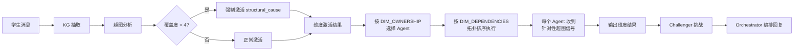

# 本周工作汇报 — 多智能体编排优化与知识图谱/超图升级

> PPT 文稿，共 13 页

---

## P1: 封面

**标题：** 多智能体编排系统 V2 — 从"固定模板"到"维度驱动的动态编排"

**副标题：** 知识图谱增强 · 超图升级 · 前端可视化重构

**日期：** 2026 年 4 月 第 X 周

---

## P2: 本周工作总览

### 核心改进三条主线

| 主线 | 核心变化 | 效果 |
|------|---------|------|
| **智能体编排优化** | 从硬编码 Agent Matrix → 维度激活驱动的动态编排 | 回复灵活性 ↑、深度可控、复杂查询自动升级 |
| **知识图谱增强** | Neo4j 图遍历三策略 + 跨项目对比 + 完整上下文 | 检索到的案例不再只是名字，能看到"别人怎么做的" |
| **超图升级** | 20 模板 + 20 一致性规则 + 分角色信号注入 | 每个 Agent 收到针对性超图信号，而非全量信息 |

### 改进前 vs 改进后

```
改进前：intent → AGENT_MATRIX[intent][tier] → 固定 Agent 列表 → 固定模板回复
改进后：intent → 维度激活(relevance×uncertainty×impact) → 动态 Agent → 策略选择 → 深度自适应回复
```

---

## P3: 智能体编排 V2 — 核心架构

### 分析维度体系（ANALYSIS_DIMENSIONS）

系统定义了 10 个分析维度，替代原来的硬编码 Agent 矩阵：

| 维度 | 标签 | 是否必选 | 说明 |
|------|------|---------|------|
| `status_judgment` | 项目状态判断 | ✅ | 判断项目阶段，整体逻辑是否通顺 |
| `core_bottleneck` | 核心瓶颈识别 | ✅ | 找到最制约推进的瓶颈 |
| `structural_cause` | 结构层原因 | ❌ | 表层问题背后的深层结构断点 |
| `counter_intuitive` | 反直觉洞察 | ❌ | 被忽略的盲区、过于乐观的假设 |
| `method_bridge` | 方法论桥接 | ❌ | 概念/方法论讲解并桥接回项目 |
| `teacher_criteria` | 评委判断标准 | ❌ | 评审者视角的优劣势和得分区间 |
| `external_reference` | 外部案例/数据 | ❌ | 真实竞品、行业数据、案例对比 |
| `strategy_directions` | 策略方向 | ❌ | 可选打法、取舍和切口 |
| `action_plan` | 行动方案 | ❌ | 本周最该做的事和验收标准 |
| `probing_questions` | 启发式追问 | ✅ | 苏格拉底式追问推动思考 |

---

## P4: 维度激活机制 — "像人一样选择性思考"

### 激活公式

每个维度的激活分数 = **relevance × uncertainty × impact**

- **relevance（相关性）**：该维度与当前 intent 的关联度（查 `_DIM_RELEVANCE_MAP`，如 `project_diagnosis` → `core_bottleneck` = 0.95）
- **uncertainty（不确定性）**：消息中对该维度的模糊程度（如学生没提竞品 → `counter_intuitive` 的 uncertainty 高）
- **impact（影响力）**：该维度对最终判断的重要性（如竞赛模式下 `teacher_criteria` impact 更高）

### 激活判定

```python
activated = score > 0.25 or dimension.required
```

### 精炼（Refine）

激活后还会被诊断结果和超图覆盖度二次修正：
- 如果超图覆盖度 < 4/10 → 强制激活 `structural_cause`
- 如果诊断触发 ≥4 条风险规则 → 提升 `counter_intuitive` 分数
- 如果 RAG 检索到高相似案例 → 提升 `external_reference` 分数

---

## P5: 维度所有权与依赖调度

### DIM_OWNERSHIP — 谁写、谁挑战

| 维度 | Writer（写入者） | Challengers（挑战者） |
|------|-----------------|---------------------|
| 项目状态判断 | Coach | — |
| 核心瓶颈识别 | Coach | **Analyst** |
| 结构层原因 | Analyst | — |
| 反直觉洞察 | Analyst | — |
| 方法论桥接 | Tutor | — |
| 评委判断标准 | Advisor | **Grader** |
| 外部案例/数据 | Advisor | **Tutor** |
| 策略方向 | Coach | — |
| 行动方案 | Planner | — |
| 启发式追问 | Orchestrator | — |

### DIM_DEPENDENCIES — 条件依赖（非固定顺序）

```
strategy_directions 依赖:
  - core_bottleneck (权重 1.0, 必须)
  - structural_cause (权重 0.7, 仅当 complexity ≥ 3)

action_plan 依赖:
  - core_bottleneck (1.0)
  - strategy_directions (0.9)

teacher_criteria 依赖:
  - status_judgment (0.8)
  - external_reference (0.5, 仅竞赛模式)
```

基于依赖关系做拓扑排序，自动划分执行阶段（Phase 1 → Phase 2 → ...），无需人工编排。

---

## P6: 回复策略自适应 — 复杂问题自动深化

### 8 种回复策略

| 策略 | 适用场景 | 长度 | 风格 |
|------|---------|------|------|
| **comprehensive** | 复杂查询 + 项目类 intent + 3+ 维度 | 2500-4500字 | 全面深度，像导师深聊 |
| **panorama** | 中等复杂 + 5+ 维度激活 | 2000-3800字 | 全面覆盖 |
| **deep_dive** | 聚焦单点分析 | 1200-2500字 | 深入剖析 |
| **challenge** | 有争议维度 / 反直觉洞察 | 800-1600字 | 犀利但建设性 |
| **progressive** | 探索阶段 / 模糊想法 | 400-800字 | 引导探索 |
| **teach_concept** | 概念学习 | 700-1200字 | 教学耐心 |
| **compare** | 竞品市场分析 | 1000-2000字 | 客观对比 |
| **casual** | 闲聊 | 100-350字 | 轻松有温度 |

### 复杂度评估增强

除了句法信号（长度、换行），新增：
- **富内容信号词**（30+ 商业/技术词汇匹配）
- **诊断丰富度感知**：触发规则 ≥4 或 KG 实体 ≥8 → 自动升级到 `complex`
- **文件上传**：直接 +2 复杂度

---

## P7: 知识图谱架构 — Neo4j 图数据库 Schema

### 节点类型（16 种）

```
Project ─────────────────── 项目根节点
├── Category              项目类别
├── Stakeholder           目标用户
├── PainPoint             痛点
├── Solution              解决方案
├── InnovationPoint       创新点
├── BusinessModelAspect   商业模式
├── Market                市场分析
├── ExecutionStep         执行步骤
├── RiskControlPoint      风险控制点
├── Evidence              证据
├── RiskRule              风险规则（20条）
├── RubricItem            评分量规项
├── OntologyNode          本体概念节点
├── EducationLevel        教育层次
└── AwardLevel            奖项级别
```

### 关系类型（15 种）

| 关系 | 起点 → 终点 | 语义 |
|------|-------------|------|
| `BELONGS_TO` | Project → Category | 所属类目 |
| `HAS_TARGET_USER` | Project → Stakeholder | 目标用户 |
| `HAS_PAIN` | Project → PainPoint | 面临痛点 |
| `HAS_SOLUTION` | Project → Solution | 提出方案 |
| `HAS_INNOVATION` | Project → InnovationPoint | 创新点 |
| `HAS_BUSINESS_MODEL` | Project → BusinessModelAspect | 商业模式 |
| `HAS_MARKET_ANALYSIS` | Project → Market | 市场分析 |
| `HAS_EXECUTION_STEP` | Project → ExecutionStep | 执行步骤 |
| `HAS_RISK_CONTROL` | Project → RiskControlPoint | 风险控制 |
| `HAS_EVIDENCE` | Project → Evidence | 支撑证据 |
| `HITS_RULE` | Project → RiskRule | 触发风险规则 |
| `EVALUATED_BY` | Project → RubricItem | 量规评估 |
| `INSTANCE_OF` | 实体节点 → OntologyNode | 概念归属 |
| `TARGETS_CONCEPT` | RiskRule → OntologyNode | 规则针对概念 |
| `REQUIRES_EVIDENCE_FROM` | RubricItem → OntologyNode | 要求证据来源 |

---

## P8: 知识图谱增强 — 三策略跨项目检索

### 双通道检索架构

```
通道 1: 向量语义检索 (RAG)
  学生描述 → bge-m3 embedding → 余弦相似度 → Top-K 案例

通道 2: Neo4j 维度图遍历 (Graph)
  学生 KG 实体 → _DIM_NODE_MAP 映射 → 三策略图遍历 → 结构排序
```

### 策略 1: 共享节点扇出（Shared-node fan-out）

```cypher
MATCH (n:PainPoint)<-[:HAS_PAIN]-(p1:Project)
WHERE toLower(n.name) CONTAINS '用户隐私'
WITH n
MATCH (n)<-[:HAS_PAIN]-(p2:Project)
RETURN p2.name, n.name AS shared_node
```

**语义：** "谁也面临这个痛点？" → 发现同类问题的项目

### 策略 2: 结构互补匹配（Structural-pattern complement）

```python
# 学生有痛点但没商业模式 → 找同时有两者的项目
if "pain_point" in student_types and "business_model" not in student_types:
    complement_targets.append(("HAS_PAIN", "HAS_BUSINESS_MODEL", "business_model"))
```

**语义：** "谁在你缺失的维度上做得完整？" → 结构互补启发

### 策略 3: 关键词回退（Keyword fallback）

当前两个策略召回不足时，用关键词模糊匹配扩大召回范围。

### 排名公式

```
score = len(matched_dimensions)
      + 3  (if shared_node)
      + 2  (if complement)
```

### 本周新增：跨项目完整上下文

排名后为每个命中项目额外查询其完整维度上下文（痛点、方案、创新、商业模式、证据），返回 `context` 字段，让前端能展示"别人怎么做的"。

---

## P9: 超图分析系统 — 20 模板 + 20 规则

### 超图模板（T1–T20 逻辑闭环模板）

超图将项目维度组合成"超边"，检测逻辑闭环完整性：

| ID | 模板名称 | 涉及维度 |
|----|---------|---------|
| T1 | 痛点-人群-解决方案-商业模式闭环 | stakeholder, pain_point, solution, business_model |
| T2 | 问题-证据-解决方案 | pain_point, evidence, solution |
| T3 | 市场-竞品-差异化 | market, competitor, innovation |
| T10 | 用户-痛点-方案-证据 | stakeholder, pain_point, solution, evidence |
| T19 | 完整商业闭环 | stakeholder → pain → solution → biz_model → evidence |
| ... | （共 20 个模板） | |

### 覆盖度评分

```python
coverage_score = len(covered_dims) / len(all_dims) × 10
# 例：覆盖了 6/10 个维度 → 覆盖度 6.0
```

### 一致性规则（G1–G20）

| ID | 规则描述 | 触发条件 |
|----|---------|---------|
| G1 | 未识别竞品或替代品 | competitor 维度为空 |
| G3 | 市场规模无数据支撑 | market 存在但 evidence 缺失 |
| G5 | 痛点与方案不匹配 | pain_point 和 solution 无交叉关系 |
| G8 | 商业模式无收入逻辑 | business_model 缺少变现路径 |
| G18 | 技术可行性未验证 | technology 存在但无 evidence |
| G20 | 完全没有风险章节 | risk 维度为空 |
| ... | （共 20 条规则） | |

### 价值链路检测

```
用户 → 痛点 → 方案       (基础三环)
方案 → 商业模式           (变现闭环)
用户 → 痛点 → 方案 → 商业模式  (完整价值环路)
痛点 → 证据验证           (验证闭环)
方案 → 技术实现           (技术闭环)
```

如果 0 条完整链路 → 警告"项目逻辑链存在断点"
如果 ≥3 条完整 → 标记"项目逻辑闭环性强"

---

## P10: 超图如何驱动智能体决策

### 分角色信号注入（`_fmt_hyper_for_agent`）

每个 Agent 只收到与其职能相关的超图信号：

| Agent | 接收的超图信号 |
|-------|--------------|
| **Coach（教练）** | 维度覆盖度、未闭合逻辑环、一致性问题+追问线索、价值链路状态、拓扑洞察 |
| **Analyst（分析师）** | 风险模式警告、特定G规则（G1/G3/G5/G8/G9/G12/G18/G20）、教学超边、关键缺失维度、断裂链路 |
| **Advisor（顾问）** | 闭环完成度、维度覆盖是否达标（竞赛基准8/10）、关键模板T1/T10/T19缺失 |
| **Grader（评分）** | 维度覆盖总览、一致性问题数、闭环完成率 |
| **Planner（规划）** | 待补维度+推荐行动、行动线索、可推进闭环 |
| **Tutor（辅导）** | 学生维度覆盖度（简化） |

### 超图 → 维度激活 → Agent 选择 流程



---

## P11: Gather 分层架构 — 按需加载

### 问题背景

旧架构：所有数据收集任务一起跑 → 简单问题也调用超图分析 → 90s 超时

### 新架构：两层 + 数据成熟度门控

```
┌─────────────────────────────────────────────┐
│ LAYER 0: 基础层（必跑，15s 超时）              │
│  ├── RAG 向量检索                             │
│  ├── KG 知识抽取                              │
│  └── Web 搜索（条件触发）                      │
├─────────────────────────────────────────────┤
│ INTER-LAYER: 实体合并 + 成熟度评估（<5ms）     │
│  ├── 合并历史 KG 实体                          │
│  └── 计算 data_maturity (cold/warm/hot)       │
│       - cold: 实体<6 且 规则<2                 │
│       - warm: 实体≥6 或 规则≥2                 │
│       - hot:  实体≥12 且 规则≥4                │
├─────────────────────────────────────────────┤
│ LAYER 1: 条件层（仅 warm/hot 触发，25s 超时）  │
│  ├── 超图教学库分析                            │
│  ├── 超图学生内容分析                           │
│  └── Neo4j 图维度遍历                          │
└─────────────────────────────────────────────┘
```

### 效果

| 场景 | 旧架构 | 新架构 |
|------|--------|--------|
| 首次简单描述 "概括一下我的项目" | 90s 超时 | 3-8s |
| 详细项目文档上传 | ~45s | ~30s（Layer 1 按需触发） |
| 多轮追问（实体已累积） | ~40s | ~25s（Layer 1 有缓存） |

---

## P12: 前端可视化重构

### 1. 知识图谱力导向图放大

| 改进点 | 改前 | 改后 |
|--------|------|------|
| 画布尺寸 | 340×220px | 460×380px（+73%） |
| 节点尺寸 | max 7px | max 10px |
| 字号 | 9px | 11px |
| 标签截断 | 5字 | 7字 |

### 2. 跨项目对比卡片（全新）

原来：只显示项目名 + 维度标签
现在：完整对比卡片

```
┌─────────────────────────────────────┐
│ 🔗 智慧停车助手  [医疗健康] [共享节点] │
├─────────────────────────────────────┤
│ 📌 相似维度                          │
│   [痛点] [方案] [商业模式]            │
│   痛点: 用户隐私保护                  │
│   方案: 联邦学习+差分隐私             │
├─────────────────────────────────────┤
│ 💡 该项目的做法                       │
│  痛点    │ 方案       │ 创新        │
│  停车难  │ 智能推荐   │ 边缘计算    │
│  信息差  │ 动态定价   │ V2X通信     │
│          │            │             │
│  商业模式          │ 证据          │
│  B2B+B2C双轮驱动  │ 3城市试点     │
└─────────────────────────────────────┘
```

### 3. 超图信号结构化展示

原来：每个 Agent 一个 `<pre>` 原始文本块
现在：分类图标 + 标签 + 内容的结构化列表

```
Coach（项目教练）  [5 条信号]
  📊 覆盖度   6.0/10
  🔗 闭环     未闭合「痛点-人群-方案-商业」缺: business_model
  ⚠️ 一致性   G1: 未识别竞品或替代品
  ❓ 追问     → 你的目标用户目前用什么替代方案？
  💡 洞察     拓扑分析显示solution节点度数最高...
```

### 4. Gather 管线状态条

实时展示 Layer 0 → Layer 1 → Insight Engine 的执行状态，以及数据成熟度。

---

## P13: 总结与下一步

### 本周核心成果

1. **编排灵活性**：从固定矩阵到维度驱动，回复不再套模板
2. **深度可控**：comprehensive/panorama/deep_dive 三档自适应，复杂问题自动深化
3. **知识图谱增强**：三策略图遍历 + 完整上下文，"别人怎么做的"一目了然
4. **超图精准注入**：6 种角色各收到不同信号，信息利用效率 ↑
5. **分层按需**：简单问题 3-8s 响应，不再无差别重型计算
6. **前端可视化**：图放大、对比卡片、结构化信号、管线状态

### 系统能力对比

| 能力 | V1（改前） | V2（改后） |
|------|-----------|-----------|
| Agent 选择 | 硬编码矩阵 | 维度激活 + DIM_OWNERSHIP |
| 执行顺序 | 固定 Phase 1→2 | 条件依赖拓扑排序 |
| 回复深度 | 固定模板 800-1500字 | 自适应 100-4500字 |
| 超图利用 | 全量注入 | 分角色裁剪注入 |
| 图谱检索 | 仅语义相似度 | 双通道（向量+图遍历） |
| 数据收集 | 全部并行跑 | 分层按需（L0→成熟度→L1） |
| 前端展示 | 原始文本 | 结构化卡片 + 对比 + 流程图 |

### 下一步计划

- 用户测试反馈收集
- 进一步优化 Challenger 质量（避免挑战退化）
- 探索跨轮次维度置信度累积
